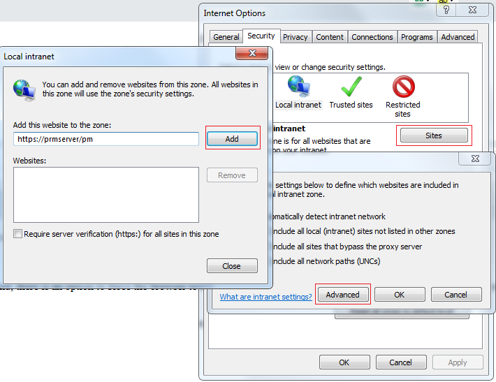
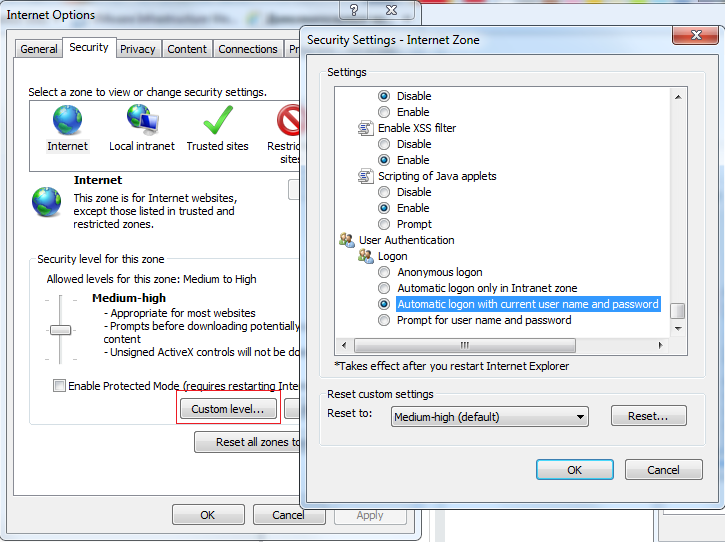

# Error 401 in the Enrollment wizard

You see the Error 401 (Not authorized) message when starting the Enrollment wizard.

## Resolution

To resolve the issue, add the Password Manager Self-service portal URL to the **Local Intranet Zone**.

1. Launch **Internet Options** from **Control Panel**
2. Go to the **Security** tab
3. Select **Local intranet**, click **Sites**
4. Click **Advanced**
5. Type the URL and click **Add**
6. Click **Close**, then **Ok**, and again **Ok**

## Workaround: Force the browser to send credentials to the Internet zone

As a workaround, you can force the browser to send credentials to the Internet zone.

1. Launch **Internet Options** from **Control Panel**
2. Go to the **Security** tab
3. Select **Internet**, click **Custom level**
4. In the **Security Settings** window that opens, scroll to the bottom
5. Select **Automatic logon with current username and password** radio-button under **User authentication - Logon**
6. Click **Ok** then **Ok** again

These settings can also be applied via Group Policy.
