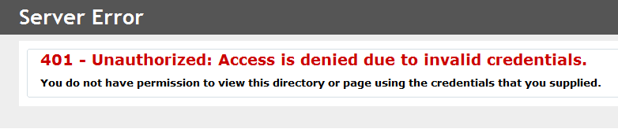
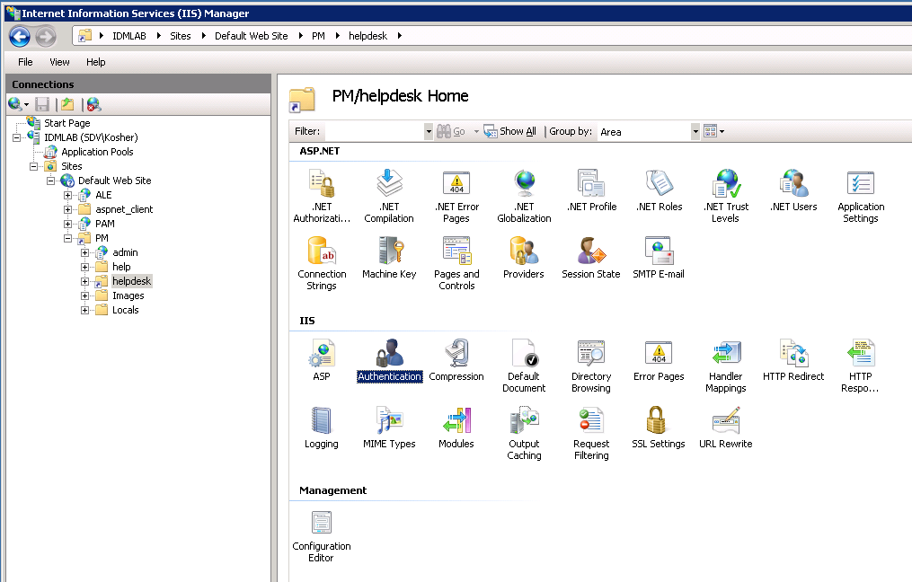
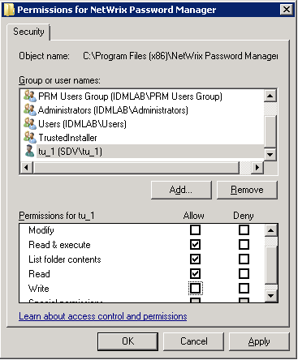
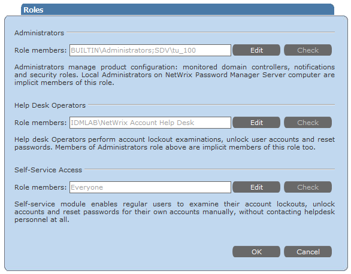

# Error 401: Unauthorized: Access is denied due to invalid credentials

Error 401 occurs when trying to access Administrative and Help-Desk Portals, while Self-Service Portal works fine.

---

This error is returned by Internet Information Services (IIS). It occurs when the authentication to Admin or Helpdesk portal fails. Administrative and Helpdesk portals have similar authentication settings, Self-Service portal has different, that is why the Self-Service portal does not return this error.

Authentication can fail because authentication settings are misconfigured or the account does not have read permissions to the physical folder on the server.

---

To resolve the issue verify authentication settings and account permisions.

1. Make sure all authentication types except **Windows authentication** or **Basic authentication** are disabled in Internet Information Services (IIS) Manager, and either **Windows** or **Basic** authentication is enabled.

   To ensure the required settings are enabled in IIS6, do the following:

   1. In **IIS Manager** left pane, navigate to `<your computer name> - Web Sites - Default Web Site - PM`.
   2. Right-click the **helpdesk** (or **admin**) virtual directory under **PM** folder and select **Properties**.
   3. In the **Properties** dialog, open the **Directory Security** tab, and select **Edit** for Authentication and access control.
   4. In the **Authentication Methods** dialog, enable either the **Integrated Windows authentication** box or **Basic authentication** (password is sent in clear text), and clear all other authentication options for Authentication access.

   

   To ensure the required settings are enabled in IIS7, do the following:

   1. In **IIS Manager** left pane, navigate to `<your computer name> - Web Sites - Default Web Site - PM - helpdesk` (or **admin**)
   2. In the Manager central pane, double-click the **Authentication** option under IIS block
   3. In the **Authentication** list, enable either **Windows Authentication** option or **Basic Authentication**, and disable all other authentication options.

    

2. The account whose credentials are specified to access the portal has Read permisison to the Password Manager instalaltion directory.

   

3. The account is granted the appropriate role: Administrators role to access Administrative portal and Help Desk Operators role to access Help Desk portal.

   

