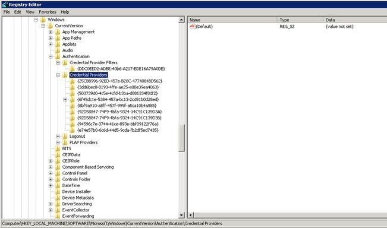
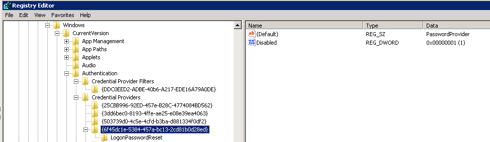

# Password Manager Credential Providers

## Overview

With Windows Vista and each Microsoft Operating System since, the Windows logon screen existed as a group of credential providers. There are several provided by default by Microsoft but also 3rd party software and hardware vendors can integrate their own credential providers as well. Credential providers listed on the logon screen are determined by the Credential Providers registry key: `HKLMSoftwareMicrosoftWindowsCurrentVersionAuthenticationCredential Providers`

The default credential provider that allows users to log in is called PasswordProvider `{6f45dc1e-5384-457a-bc13-2cd81b0d28ed}`.

## Credential provider types the Password Manager client can install

There are two types of credential providers the Password Manager client can install:

- An icon
- A link

### Icon installation

When you install an icon you simply create an additional credential provider called Netwrix Password Manager Credential Provider for Windows Vista `{92D58847-74F9-4bfa-9324-14C139D3B}`. This icon shows when clicking the **Other Credentials** button on the logon screen.

### Link installation

When a link is used, however, the process becomes a bit more complicated since the logon screen cannot show more than one credential provider at a time. By default the PasswordProvider is shown. Since you cannot modify this credential provider you must disable it and replace it with one of your own and disable the original.

This credential provider is called Netwrix Password Manager Credential Provider for Windows Vista `{92D58847-74F9-4bfa-9324-14C139D3A}`. Note the only difference in GUID of the two Password Manager credential providers is the last value (A or B). This can help in determining automated ways to know which method, link or icon, is being used.

## Important deployment notes

An important note is that when you deploy a link, if there is another 3rd party credential provider, or a Credential Provider Filter put into the system, there might be conflicts, and this may lead to issues with the logon screen when no actual logon providers are present. That is why we recommend installing the link only to brand new machines without any software that puts its own credential providers (like fingerprint scanners, etc).
