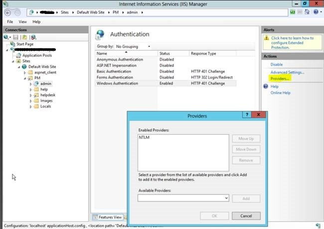

# Windows Authentication Doesn't Work - HTTP Error 401

## Overview

This article addresses the issue of receiving HTTP error 401 when attempting to use Windows authentication in the Admin and Helpdesk portal. It provides steps to ensure that the configuration is set up correctly.

## Symptom

You configured the Admin and Helpdesk portal per the [KB1162](https://kb.netwrix.com/1162) to use Windows authentication; however, you keep getting HTTP error 401. Switching to Basic authentication works fine, but you prefer not to use it.

## Cause

Windows authentication in IIS depends on the providers it uses. If the providers are configured incorrectly, Windows authentication will not work.

## Resolution

Make sure the providers for Windows authentication are configured correctly. Follow these steps:

1. Launch **IIS Manager**.
2. Navigate to the **admin** virtual directory (by default, it is `%Server name% - Sites - Default Web Site - PM - admin`).
3. Go to **Authentication** configuration.
4. Select (highlight) **Windows Authentication**.
5. In the right pane, click **Providers**.
6. Ensure **NTLM** is present. Add it if needed.
7. Click **OK** to apply changes.

