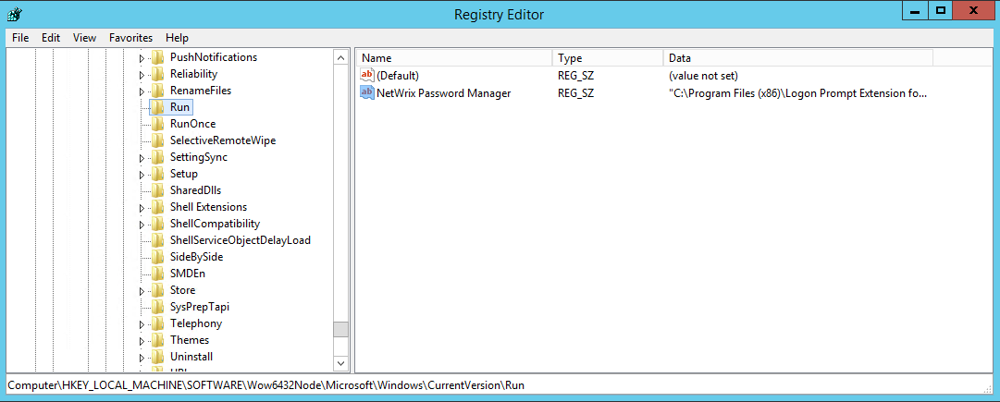

# How to remove Enrollment Wizard from startup

How can I remove Enrollment Wizard from startup after deployment of the client?

Please see [KB2014](https://kb.netwrix.com/2014) if you are looking for a way to disable the client from adding itself to startup. During deployment the client adds a Reg_SZ value called `Netwrix Password Manager` to the startup registry key.

## Registry keys

- In 32-bit OS the key is `HKEY_LOCAL_MACHINE\SOFTWARE\Microsoft\Windows\CurrentVersion\Run`
- In 64bit OS the key is `HKEY_LOCAL_MACHINE\SOFTWARE\Wow6432Node\Microsoft\Windows\CurrentVersion\Run`

## Remove or disable the Enrollment Wizard

To prevent the Enrollment wizard from running on startup you need to remove the value, or alternatively change its value to point to a non-existing executable. The value can be removed or changed on several machines by means of Group Policy.

- Open the registry key shown above on the target machine.
- Locate the `Reg_SZ` value named `Netwrix Password Manager`.
- Either:
  1. Delete the `Netwrix Password Manager` value to remove the startup entry, or
  2. Edit the value and change its data to point to a non-existing executable path to disable startup behavior without deleting the entry.
- To apply this change across multiple machines, use Group Policy to delete or modify the registry value remotely.
