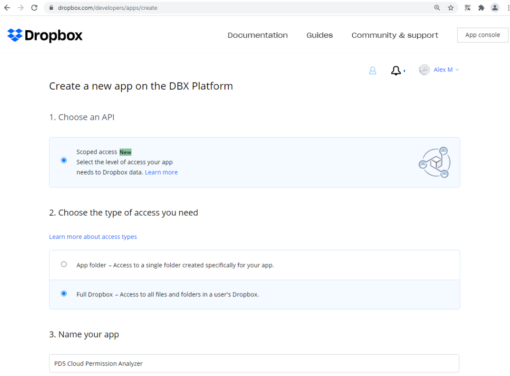

# Cloud Permission Analyzer Configuring Dropbox Apps

This article will cover the process of configuring Netwrix Cloud Permission Analyzer (CPA) to work with Dropbox using Dropbox Apps. This process is divided into two parts: Dropbox configuration and Cloud Permission Analyzer configuration.

## Dropbox Configuration

1. In your web browser, log in to Dropbox using an admin account (or TeamAdmin if you have an Advanced subscription with tiered admin permissions).
2. Go to the Dropbox developer page: https://www.dropbox.com/developers/apps

3. Create a new app with these settings:
   - Choose an API = Scoped Access
   - Choose the type of access you need = Full Dropbox
   - Name your app = `Netwrix Cloud Permission Analyzer for <team name>` *

   
   

   **NOTE**: Name of the App should be unique among all the Dropbox Apps.

4. On the page with the created app do the following:

   4.1. In the **Permissions** section, choose the following permissions:
   - Individual: `files.metadata.read`, `sharing.read`, `files.content.read`
   - Team: `team_info.read`, `team_data.member`, `members.read`, `groups.read`

   4.2. In **Settings** section, generate the Access Key:
   - set OAuth 2/Access Token Expiration = `No Expiration`
   - generate access token in OAuth 2/Generated Access Token/[Generate]

   

   4.3. Check the setting responsible for the usage of the Apps outside the App Center.
   - In Dropbox, go to **Admin console > Settings > Application permissions > Other apps** and check the status of **Default permission for apps not listed in App Center**
   - If it is in **Block** state, there are 2 ways to make an app work.
     - The simple one is to change **Block** state to **Allow**, but it will also allow all the other apps from outside of App Center.
     - A more difficult, however more secure way is to add the App to the exception list. To do so:

       1. In the **App Console**, on the **Settings tab**, copy the `App key`.

       

       2. In the **Admin console > Settings > Application permissions** on the Other apps tab: click **Add exception**, and in the window that appears, insert the `App key` from the previous step.
       3. Select the **Allow** option.
       4. After that, if everything is done right, the App should appear in the exceptions list.

   **NOTE**: By default the new app is created with the "Development" Status. It is recommended to leave the status as is, as changing it to production will yield no additional use for CPA."
   **N.B.** It is possible to use Short-Lived tokens with CPA; however, you will not be able to obtain newly generated Tokens automatically. If you choose short-lived tokens, you will have to manually insert a new token every day inside CPA.

## Cloud Permission Analyzer Configuration

1. Before binding Cloud Permission Analyzer to Dropbox, configure the collection settings.
2. To bind Cloud Permission Analyzer to Dropbox, fill in the following fields in the settings:
   - `Dropbox administrator account` = Dropbox Admin email
   - `Dropbox Access Token` = Token, generated during step 4.2 of the Dropbox Configuration process

3. Return to the overview page and wait for the Collection to finish.
