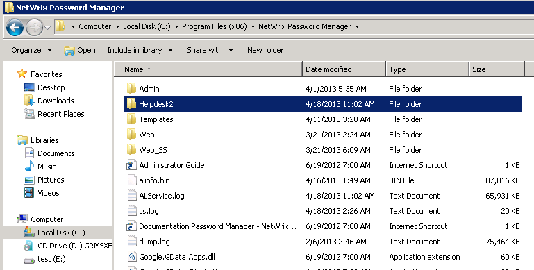
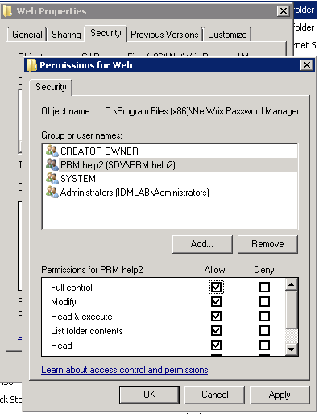
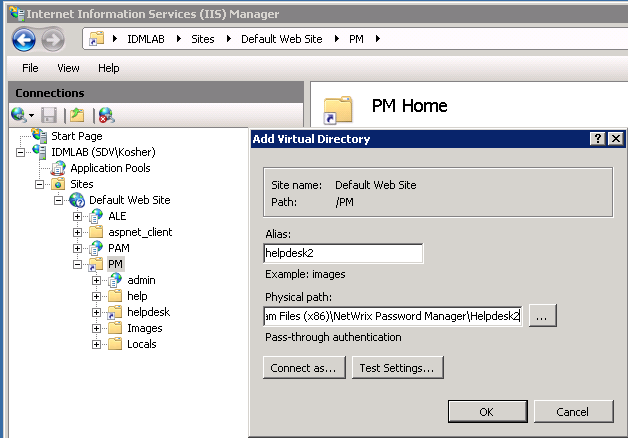

# How to create second Help-Desk portal

Is there a way to create separate Help-desk portal? Can we have certain users have certain permissions on the second Help-desk portal?

To create another portal and assign permissions, do the following:

1. Navigate to the Netwrix Password Manager installation directory, the default path: `C:Program Files (x86)Netwrix Password Manager`.
2. In the installation directory, create a copy of the **Web** folder and name it as **Helpdesk2**.

3. Select the **Web** folder, right-click it and select **Properties**.
4. In the **Properties** dialog, navigate to the **Security** tab and change Windows security permissions:
   - disable all inherited permissions
   - leave full control for SYSTEM, CREATOR OWNER, Administrators
   - create a group of users who should have access to the fully functional Help-desk portal, and grant this group full control.

5. Start the Internet Informational Services (IIS) Manager.
6. In the left pane, navigate to **%ComputerName%** - **Sites** - **Default Web Site** - **PM**, right-click the **PM** node and select **Add Virtual Directory**.
7. In the **Add Virtual Directory** dialog, specify **Alias** (for example, helpdesk2), and **Physical path** to the new directory created earlier: `C:Program Files (x86)Netwrix Password ManagerHelpdesk2`.

8. Make sure that only Windows authentication is enabled for this new virtual directory.
9. Open the **Administrative portal**, go to **Roles** and add the security group created in step 4 to the **Help Desk Operators** role.

Now you have two Help-desk portals:

1. [http://prmserver/pm/helpdesk2](http://prmserver/pm/helpdesk2) - can be accessed by all users, granted the Help Desk Operators role.
2. [http://prmserver/pm/helpdesk](http://prmserver/pm/helpdesk2) - can be accessed only by Administrators and the special security group you have created.

If you want to add or remove some functionality from the second Help-desk portal, please [contact Netwrix Technical Support](https://www.netwrix.com/support_ticket.html).
