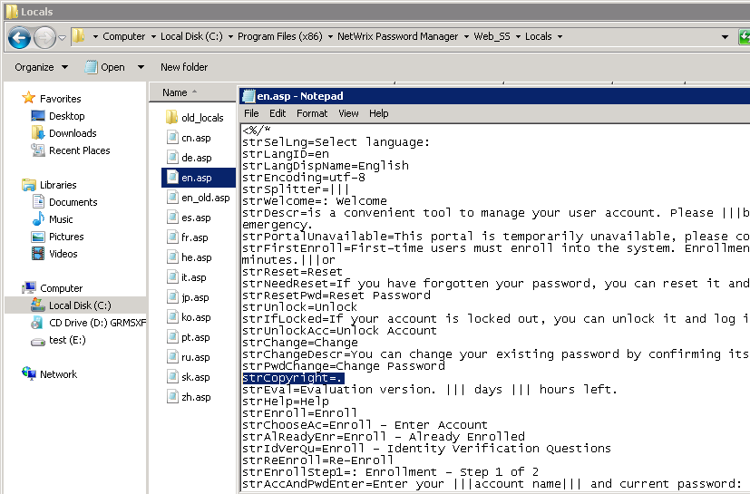

# How to customize text in the Password Manager Self-Service portal

## Overview
All text on the Password Manager Self-Service Portal is determined by string values and can be changed. If you want to customize any string of text in the Self-Service portal, edit the appropriate language `.asp` file and restart IIS.

## Procedure
1. Navigate to the Password Manager installation folder.
2. Locate the sub-folder called **Web_SSLocals**.
3. Locate the `.asp` file that corresponds with the language used on the Self-Service portal. By default - `en.asp`. Open it with Notepad.
4. Edit any string value in the file and save it.
5. Execute the `iisreset` command.

Names of values are intuitive. If you want to remove a string of text completely, leave the value blank.

For example, if you want to remove the copyright text, set `strCopyright=`.

## Language files
| File   | Language            |
|--------|---------------------|
| `cn.asp` | Chinese             |
| `de.asp` | German              |
| `en.asp` | English             |
| `es.asp` | Spanish             |
| `fr.asp` | French              |
| `he.asp` | Hebrew              |
| `it.asp` | Italian             |
| `jp.asp` | Japanese            |
| `ko.asp` | Korean              |
| `pt.asp` | Portuguese          |
| `ru.asp` | Russian             |
| `sk.asp` | Slovak              |
| `zh.asp` | Traditional Chinese |
