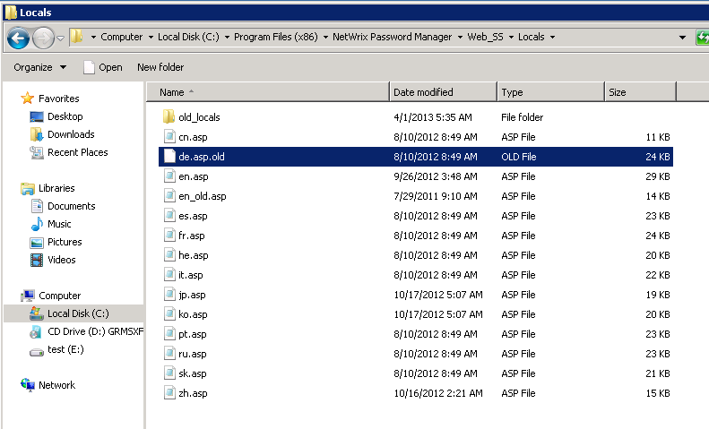

# How to remove languages from the Self-Service Portal

How to remove certain languages from the list displayed on the Self-Service portal?

In order to remove languages from the webpage, perform the following steps:

1. Open the `Web_SSLocals` subfolder of the Password Manager installation directory.
2. Change the file extension for all languages that should not be displayed on the web portal.
3. Execute the `iisreset` command on the web-server.

The following table lists the files and their corresponding languages:

| File | Language |
|------|----------|
| `cn.asp` | Chinese |
| `de.asp` | German |
| `en.asp` | English |
| `es.asp` | Spanish |
| `fr.asp` | French |
| `he.asp` | Hebrew |
| `it.asp` | Italian |
| `jp.asp` | Japanese |
| `ko.asp` | Korean |
| `pt.asp` | Portuguese |
| `ru.asp` | Russian |
| `sk.asp` | Slovak |
| `zh.asp` | Traditional Chinese |

EXAMPLE: to remove German, rename the `de.asp` file to `de.asp.old`

NOTE: English (`en.asp`) cannot be removed by design of the software
