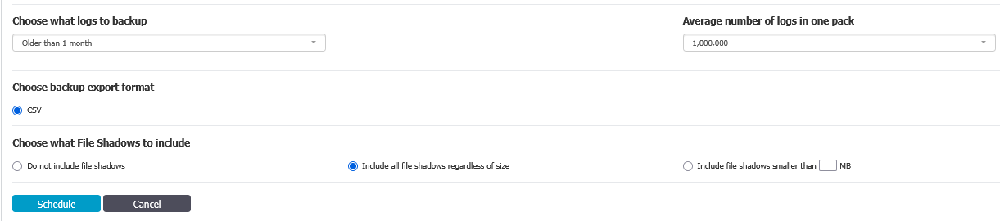

# Password requirements link

There is an option to specify **Password requirements URL** in the **Branding** settings on the **Administrative portal**.

When you specify a link in this field, it will not appear on the **Self-Service portal** itself.

The **Password requirements URL** is shown on an error screen that occurs if a specified password does not meet the password policy.

Please [contact Netwrix support](https://www.netwrix.com/support_ticket.html) if you want to change this behavior.
