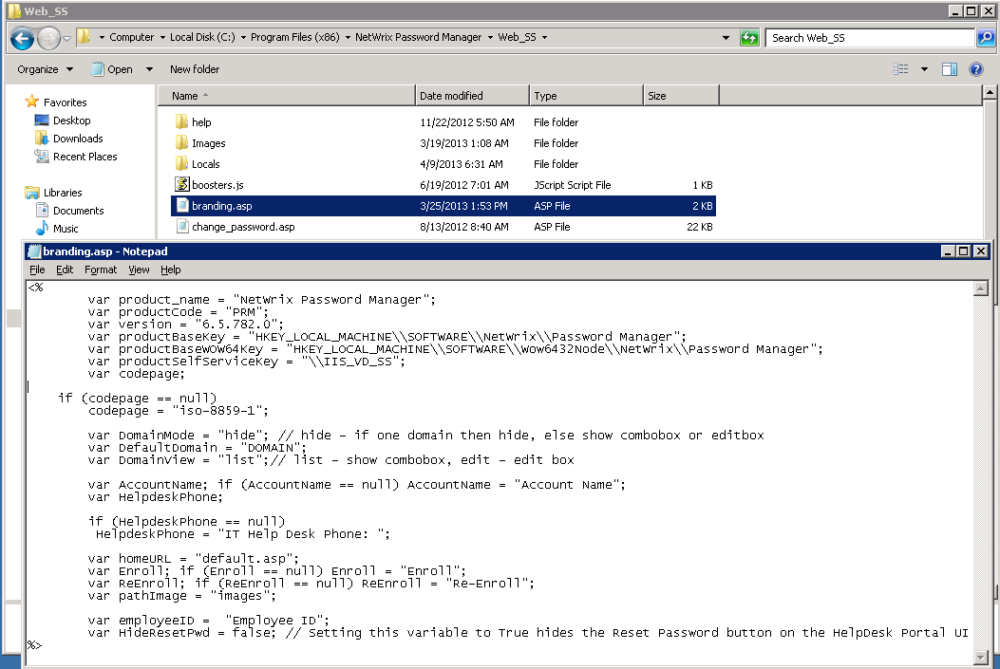

# Remove the domain list from the Self-Service portal

To hide the domain list, do the following:

## Procedure

1. Navigate to the `Web_SS` folder of the Password Manager installation directory.
2. Locate the `branding.asp` file and edit it:
   - Locate the `DomainMode` parameter and set it to `'hide'`. This will hide the domain list from the **Self-Service portal**.
   - Locate the `DefaultDomain` and enter the predefined domain name.
3. Save the changes to the file and refresh the **Self-Service portal**.

