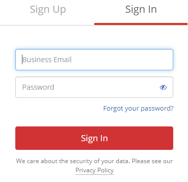
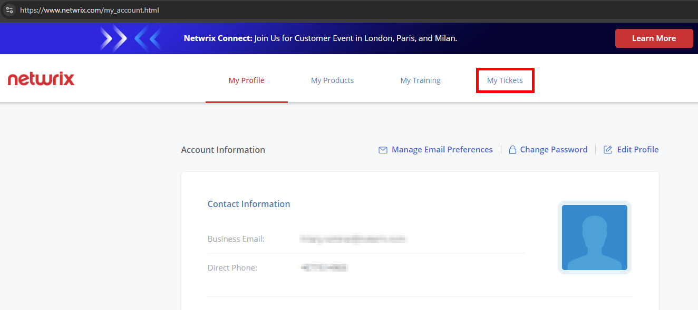
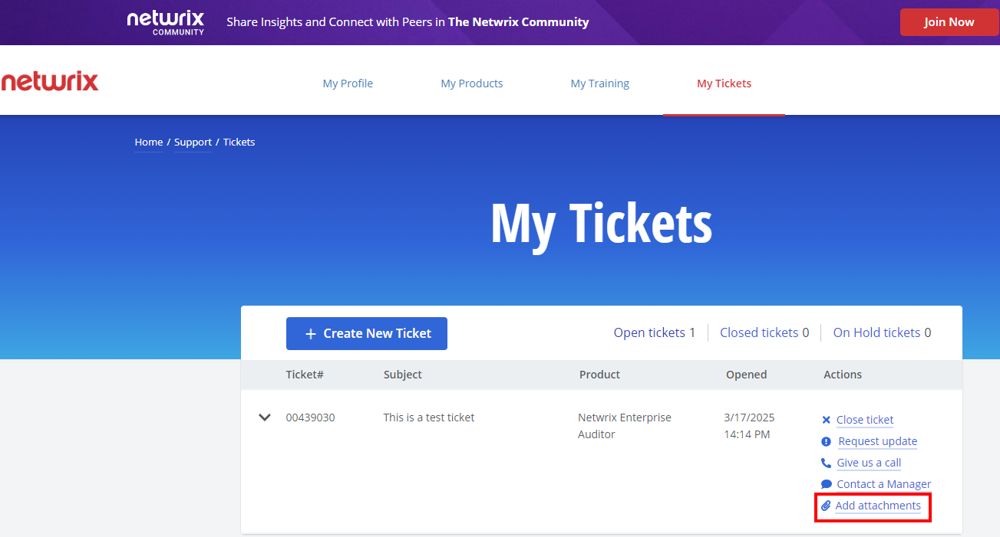
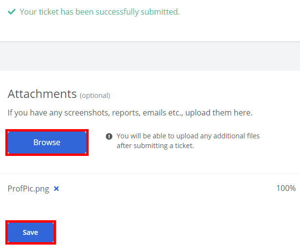
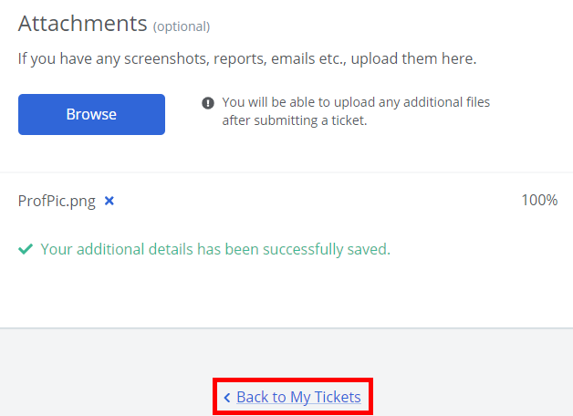

# How to Add Attachments to Netwrix Support Tickets

## Question

How can you add attachments (e.g., files) to a Netwrix Support ticket?

## Answer

Uploading artifacts to the ticket via the Netwrix Customer Portal is the most secure and recommended way to send files to Netwrix Support. To add attachments such as files to a Netwrix Support ticket, follow the steps below:

1. Log in to the Netwrix Customer Portal at https://netwrix.com/my_account.html.  
   

2. Click the **My Tickets** tab.  
   

3. Locate the ticket for the artifacts and select **Add attachments** from the Actions column on the right.  
   

> **NOTE:** There is also the option to upload attachments immediately upon submitting a ticket once the **Browse** button is enabled using the below steps:
>
> 1. Click **Browse**, select your file(s), and click **Save**.  
>    
>
> 2. Click **Back to My Tickets** to view your ticket. If needed, this is where you can upload any additional files via the **Add attachments** Action button of the ticket interface.  
>    
