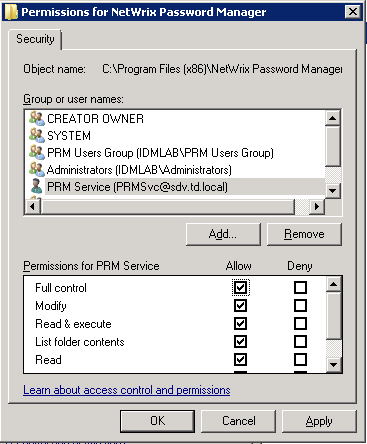
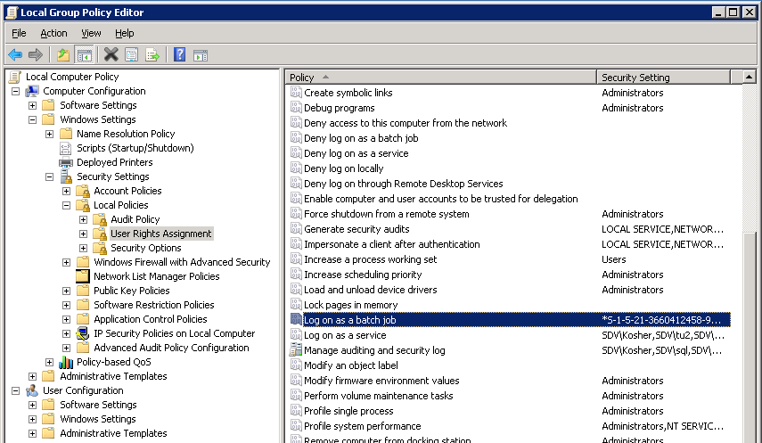
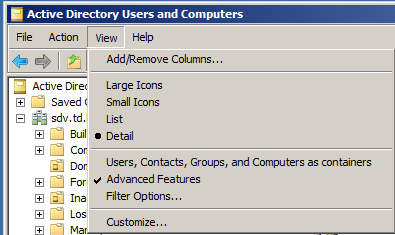
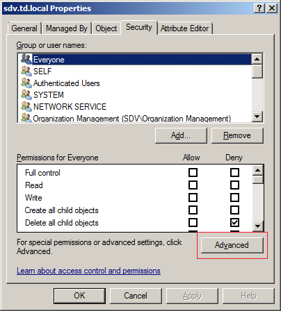
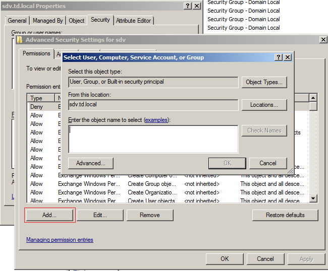
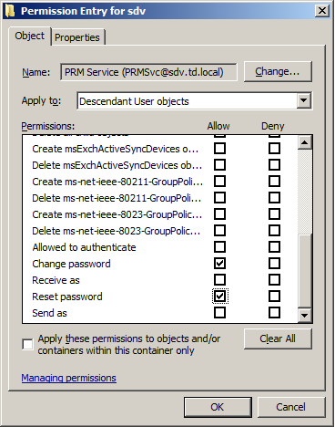
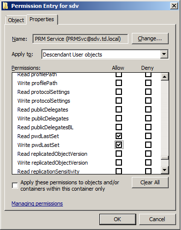

# NetWrix Password Manager service account

Since this software is used to change/reset passwords and unlock Active Directory (AD) user accounts, the service account must have sufficient permissions to perform these operations. We recommend using an account that is a member of the Domain Administrators group and the local Administrators group on the computer where the product is installed.

If you do not want to use a Domain Administrator account, on the computer where NetWrix Password Manager is installed, create an account with the following rights and permissions.

1. On the machine where the Password Manager service is installed:

- Full access to the NetWrix Password Manager installation directory (Allow Full control security permissions)
- Full access to the registry key `HKLM\Software\Wow6432Node\NetWrix Password Manager` (Wow6432Node only for x64 OS) (Allow Full control security permissions)
- The Logon as a service right (added to **Local policies** > **User rights assignment** > **Logon as a service** policy)

  

Alternatively, you can add the service account to the local Administrators group.

2. In Active Directory the service account should have the following rights for all managed accounts:

- Change Password
- Reset Password
- Read Account Restrictions
- Write Account Restrictions
- Read lockoutTime
- Write lockoutTime
- Read pwdLastSet
- Write pwdLastSet

To grant these rights to the service account in AD, do the following:

1. Navigate to **Start** > **Administrative Tools** > **Active Directory Users and Computers**.
2. Select **View** from the main menu and make sure that the **Advanced Features** option is selected.

3. In the left pane, right-click the managed domain node and select **Properties** from the pop-up menu.
4. Open the **Security** tab and click the **Advanced** button.

5. In the Advanced Security Settings dialog, in the **Permissions** tab, click the **Add** button.
6. Select the account you want to use as the service account and click **OK**.

7. In the Permission dialog that opens after you have specified an account, in the **Object** tab, under Apply to, select `Descendant User objects` from the drop-down list.
8. Select the following check boxes in the Allow column:
   - Reset Password
   - Change Password

9. In the **Properties** tab, under Apply to, select `Descendant User objects` from the drop-down list.
10. Select the following check boxes in the Allow column:
    - Write Account Restrictions
    - Read Account Restrictions
    - Read lockoutTime
    - Write lockoutTime
    - Write pwdLastSet
    - Read pwdLastSet

11. Click **OK** to save the changes.

NOTE. A less privileged service account is not able to unlock and reset passwords for protected domain groups (domain admins, enterprise admins, etc.) because of the AdminSDHolder access control mechanism.

AdminSDHolder is a container inside Active Directory that maintains a master list of permissions for objects that are members of privileged groups in Active Directory. Access control prevents access of non-privileged accounts to this container.

Below are some of the protected groups that cannot be handled without domain admin rights:

- Administrators
- Domain Admins
- Enterprise Admins
- Schema Admins
- Domain Controllers
- Server Operators

More information about it here:
http://blogs.technet.com/b/askds/archive/2009/05/07/five-common-questions-about-adminsdholder-and-sdprop.aspx

http://tsmith.co/2011/what-is-adminsdholder/
