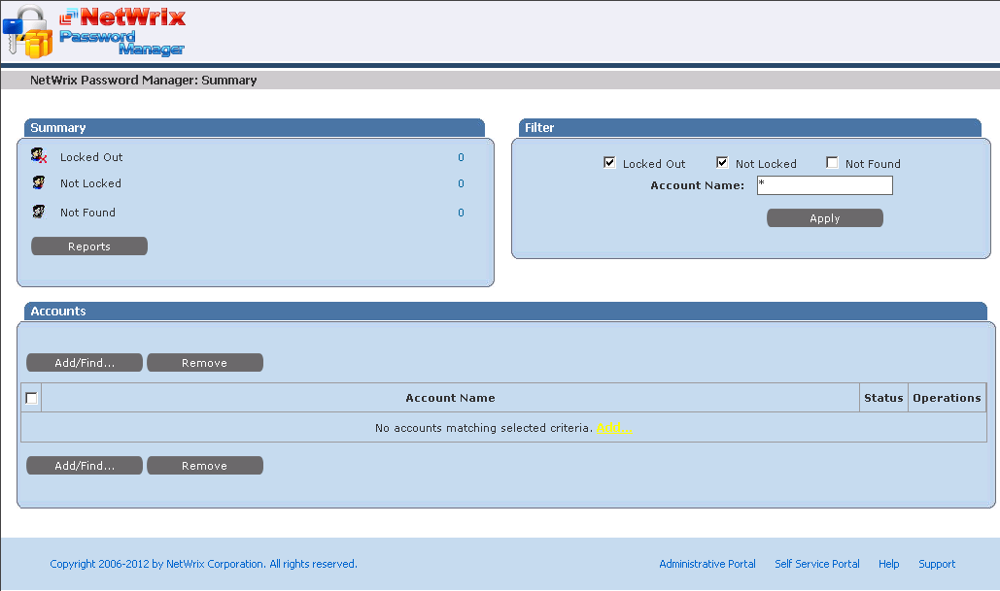
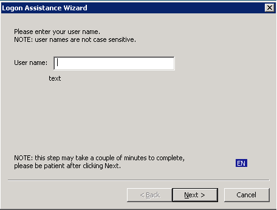
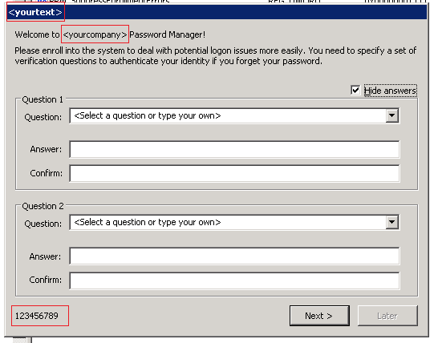

# Password Manager architecture

Netwrix Password Manager is a web-based application that actually consists of 3 parts:

1. **Core service**
2. **Web service**
3. **Local client**

## 1. Password Manager Service

1. **Password Manager Service:** executes the operations in AD requested through the web portals. It communicates with Active Directory via encrypted LDAP and RPC channels.

Password Manager Service holds a secure profile database in the local file system.

## 2. Web-service

2. **Web-service** provides GUI to work with the service through the browser. It includes 3 portals:

- **Administrative Portal:** allows configuring password policies and user options, importing user account data for batch enrollment, etc.

- **Help-Desk Portal:** allows centralized management and reporting on the enrolled users" accounts."

- **Self-Service Portal:** a web-interface for end users to perform password management operations without contacting the help-desk.

Web-service is based on IIS services and can be accessed via the HTTP or HTTPS protocol. The web service, in turn, connects to the Password Manager Service via the RPC protocols.

## 3. Password Manager client

3. **Password Manager client** is deployed to workstation and allows to access self-service password management without logging on. It is also referred as Windows Logon Prompt Extension because it extends the standard Windows logon prompt and pops up a dialog box that allows end users to perform self-service password management operations.

It also supports the enrollment wizard.

The client part uses web-requests (IE engine) to connect to the Password Manager web-service via the HTTP or HTTPS protocol.

## Summary

Both Password Manager Client and Web Clients connect to the web service via the HTTP or HTTPS protocol. The web service, in turn, connects to Password Manager Service via the RPC protocol. The Password Manager Service holds a secure profile database in the local file system, and communicates with Active Directory via encrypted LDAP and RPC channels.
