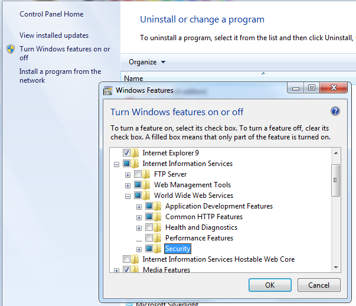
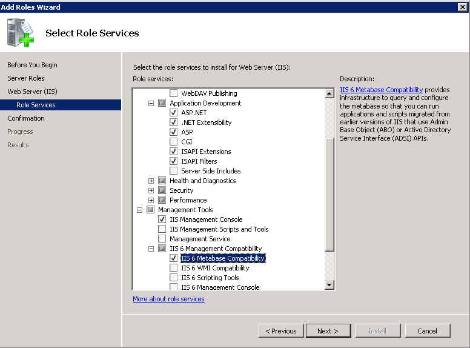
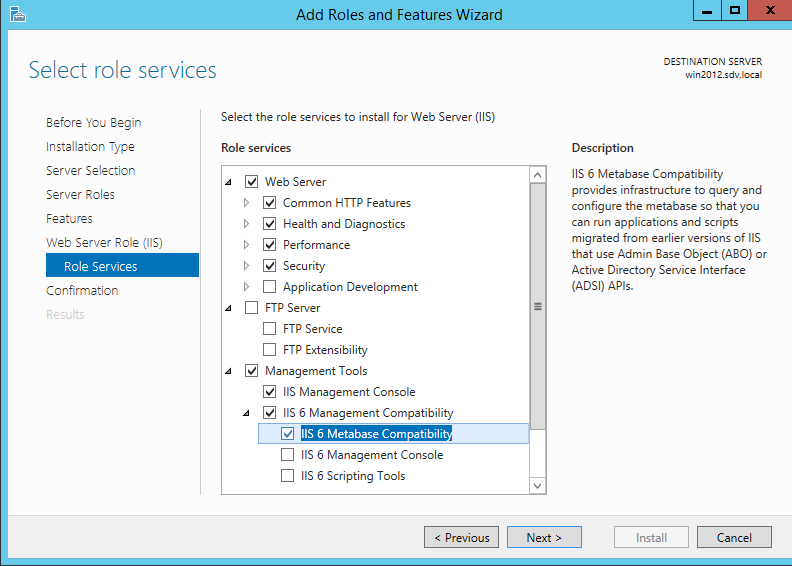

# Password Manager Requirements

Password Manager is a 32-bit web application based on Microsoft IIS.

## Server requirements

Password Manager server requires:

- Windows XP SP3 or above
- Windows Installer 3.1 or above
- .NET Framework 3.5 SP1 (on Server OS is provided as a server feature that needs to be enabled)
- Microsoft Internet Explorer 6.0 or above / Mozilla Firefox 2.0 or above / Apple Safari 2.0 or above / Google Chrome 4.0 or above
- IIS 6.0 or above (Web Server role in Server OS)

Within the IIS role it requires the following features enabled:

- ASP extension
- ASP.NET extension
- IIS 6 Metabase Compatibility
- Windows authentication
- Static content

## Enable required IIS features on client OS (Windows Vista, 7, 8, 8.1, 10)

To enable these modules on the client OS, perform the following steps:

1. Open **Programs and Features** (Control Panel - **Programs and Features**).
2. Enable **Turn Windows features on or off**.
3. Open the following node: **Internet Information Services (IIS) - Web Management Tools - IIS6 Management Compatibility**.
4. Enable **IIS6 Metabase Compatibility** item.
5. Open the following node: **Internet Information Services (IIS) - World Wide Web Services - Security**.
6. Enable **Windows Authentication** item.
7. Open the following node: **Internet Information Services (IIS) - World Wide Web Services - Application Development Features**.
8. Enable **ASP** and **ASP.NET (3.5)**.
9. Open the following node: **Internet Information Services (IIS) - World Wide Web Services - Common HTTP Features**.
10. Select **Static content**.
11. Click **OK**.

## Enable required IIS features on Windows Server 2008 and 2008 R2

To enable these features on Windows Server 2008 and 2008R2, perform the following steps:

1. From **Server Manager**, select **Roles - Web Server (IIS)** in the left pane.
2. In the right-hand pane scroll to **Role Services** and click **Add Role Services**.
3. Expand **Management Tools - IIS6 Management Compatibility** node and enable **IIS6 Metabase Compatibility**.
4. Expand **Application Development** node and enable **ASP** and **ASP.NET extensions**, confirm installation of all depending services.
5. Expand **Security** node and enable **Windows Authentication**.
6. Expand **Common HTTP features** and enable **Static content**.
7. Click **Next** and then click **Install**.

## Enable required IIS features on Windows Server 2012 and 2012 R2

To enable these features on Windows Server 2012 and 2012R2, perform the following steps:

1. From **Server Manager**, select **Manage - Add Roles and Features** at the top right.
2. Select the **Role-based installation** option, select the current server from the list.
3. In the left pane select **Web Server Role (IIS) - Role services** node.
4. Expand **Management Tools - IIS6 Management Compatibility** node and enable **IIS6 Metabase Compatibility**.
5. Expand **Application Development** node and enable **ASP** and **ASP.NET 3.5** extensions, confirm installation of all depending services.
6. Expand **Security** node and enable **Windows Authentication**.
7. Expand **Common HTTP features** and enable **Static content**.
8. Click **Next** and then click **Install**.

