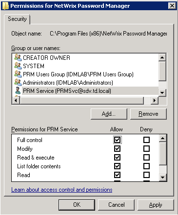
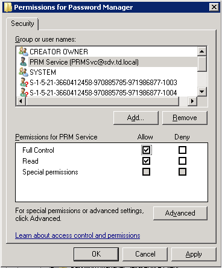

# Cannot access Licensing page

## Symptoms

I get the following error when trying to get to a License page in the Administration console of the Password manager.

An error occurred on the server when processing the URL. Please contact the system administrator.
If you are the system administrator please click here to find out more about this error.

---

## Cause

The error occurs because Password Manager service fails to get information about current license form the registry.

---

## Resolution

To address the issue make sure that the Password Manager service account has Full control on the following:

1. Password Manager installation directory
2. Registry key `HKLMSoftware[Wow6432Node]NetwrixPassword Manager (Wow6432Node only for x64 OS)`

Even if the service account is a member of local Administrators group, please try to grant Full control to the service account explicitly.
Restart the Netwrix Password Manager service after granting permissions.
