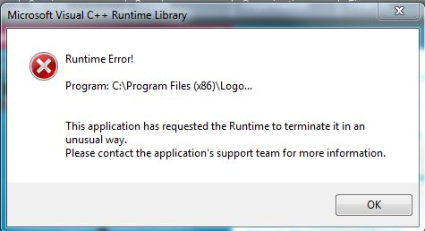
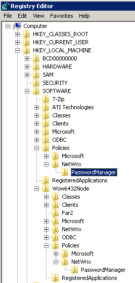

# Client crash - Runtime Error!

I deployed the Password Manager client on several machines and on some of them I receive the following error at startup

---

The application adds files to Program files and keys to the registry, also registers its components in registry.  
The error above occurs because some of required components were not installed or registered.

The most common reason is the lack of permissions granted to the account under which the client was installed.  
Microsoft User Account Control (UAC) can also cause this.

---

1. First of all make sure that the account used to deploy the client has full access to the local system (local admin permissions or local system account).
2. Try perform the deployment with UAC disabled.

If the issue persists, please manually check that after deployment of the client the following registry keys exist.

- `HKEY_LOCAL_MACHINE\SOFTWARE\Policies\NetWrixPasswordManager`
- `HKEY_LOCAL_MACHINE\SOFTWARE\Wow6432Node\Policies\NetwrixPasswordManager` (this is only in 64-bit OS)

If the key does not exist you can create it manually. No values are necessary.  
Change the deployment procedure to create this key.
