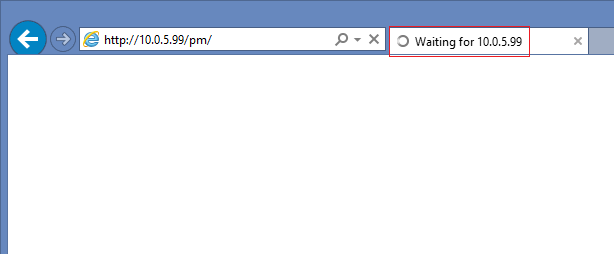
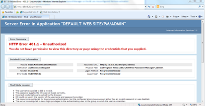

# Common issues of installation in DMZ

Installation of Password Manager Web-sites in DMZ can cause several issues. **NOTE.** To troubleshoot a DMZ installation all 3 portals must be tested as there are several scenarios.

### Issue 1: Portals never load — just stay blank in loading state

**Explanation:** Refer to the [KB1315](https://kb.netwrix.com/1315)  
---------------

### Issue 2: Self Service portal does not load at all, Admin and Helpdesk portals return a Server.CreateObject Failed error

 

**Explanation:** Refer to the [KB1314](https://kb.netwrix.com/1314).  
---------------

### Issue 3: Self Service portal does not load at all, Admin and Helpdesk portals return a Server.CreateObject Access error

 

**Explanation:** Refer to the [KB1308](https://kb.netwrix.com/1308).  
---------------

### Issue 4: Self-Service portal works fine, while Admin and Helpdesk return the Server.CreateObject Access error

 

**Explanation:** Specific for non-domain front-end server. Refer to the [KB1310](https://kb.netwrix.com/1310).  
---------------

### Issue 5: Admin and Helpdesk portals work, but Self-service returns an error or does not load at all

**Explanation:** Refer to the [KB1303](https://kb.netwrix.com/1303).  
---------------

### Issue 6: Self-Service portal works fine but you get a 401 - Unauthorized error on Admin and Helpdesk portals

**Explanation:** You need to use accounts that the front-end is aware of and which have appropriate rights on the front-end server. Refer to the [KB1368](https://kb.netwrix.com/1368) in case of a non-domain front-end.
