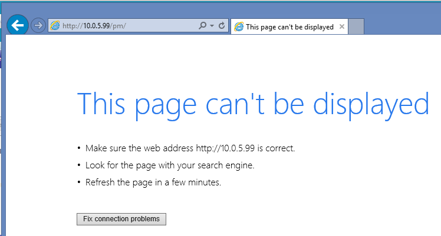
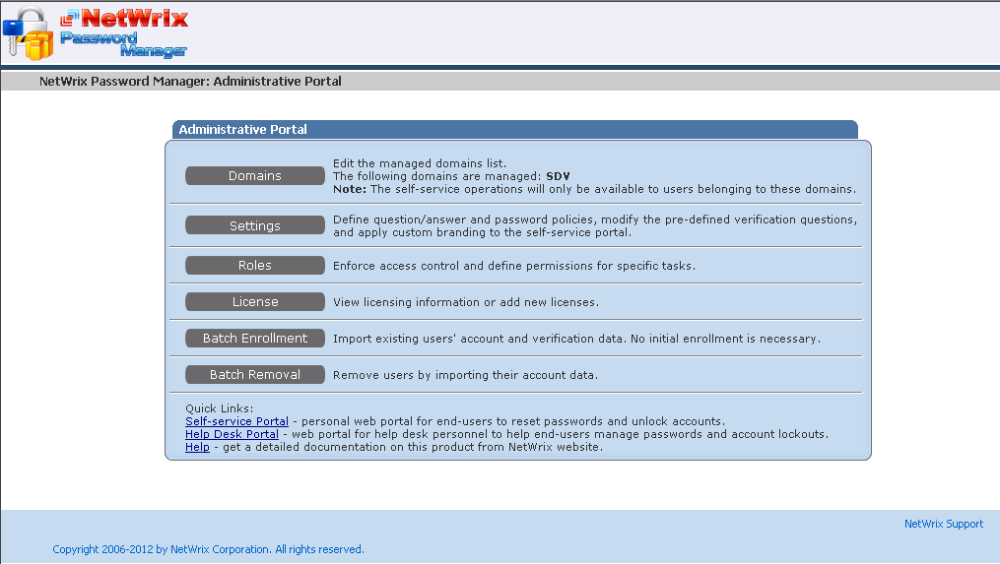
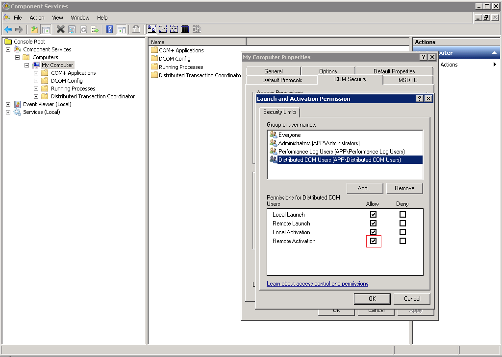
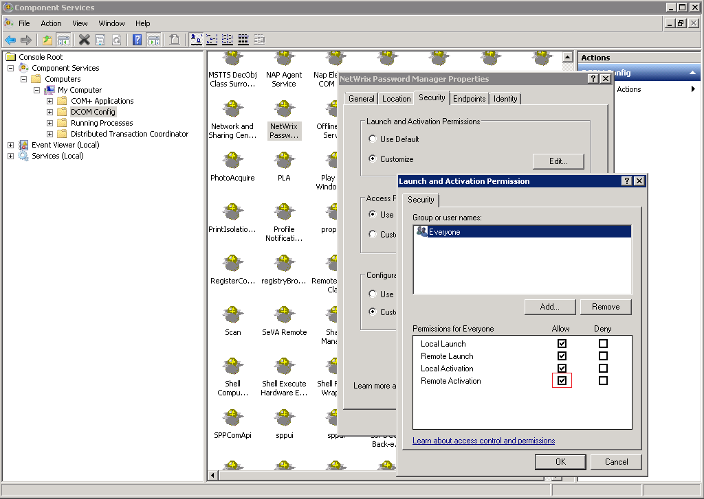

# DMZ installation: Self-Service portal does not load while Admin and Helpdesk portals work fine

## Symptoms
The Self-service portal returns an error or does not load at all.

However Admin and Helpdesk portals work.

---

## Cause
When you log in to the **Admin** or **Helpdesk** portal, the portal prompts for credentials and then uses those credentials to communicate with the back-end once authentication is complete. The Self-Service portal uses anonymous authentication and, as a result, uses the account specified in IIS at **Connect as**:

The issue occurs when the account specified for anonymous authentication in **Connect as** does not have the required permissions on the back-end server.

---

## Resolution
Make sure that COM settings on the back-end server are correct:

1. Ensure **COM Security** properties for the **My Computer** node allow `Remote activation`.

   

2. Ensure properties of the Netwrix Password Manager COM object allow `Remote activation`.

   
