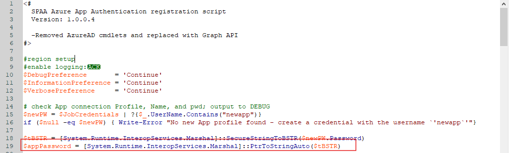

# Error C:38 - Unable to Connect to SharePoint Online

## Symptoms

When running the SharePoint Job Group and attempting a connection to SharePoint Online, the following issues appear:

- There is a failure in the connection attempt.
- The system generates the following error message:

```
Error C:38 - Unable to Connect to SharePoint Online
```

## Cause

The PowerShell (PS) script used in the `SP_RegisterAzureAppAuth` Job was not configured to use the password associated with the temporary connection profile.

## Resolution

To resolve this error, follow these steps:

1. Replace the app password value within the PS script with the password associated with the Azure AD connection profile.

   

2. After updating these lines within the PS script and the connection profile, run the `SP_RegisterAzureAppAuth` Job. This job generates a new connection profile and automatically opens a browser to confirm permissions.

   > **NOTE:** For more information about the `SP_RegisterAzureAppAuth` Job, refer to the following article: SP_RegisterAzureAppAuth Job.

3. Once the new profile is created, add the **newly generated .pfx file** into the generated file path along with the password for the connection profile into the SharePoint connection profile.

4. Apply the **newly generated connection profile** to the SPAA system scans job. This should successfully connect you to the SharePoint site.

## Related Article

- SP_RegisterAzureAppAuth Job