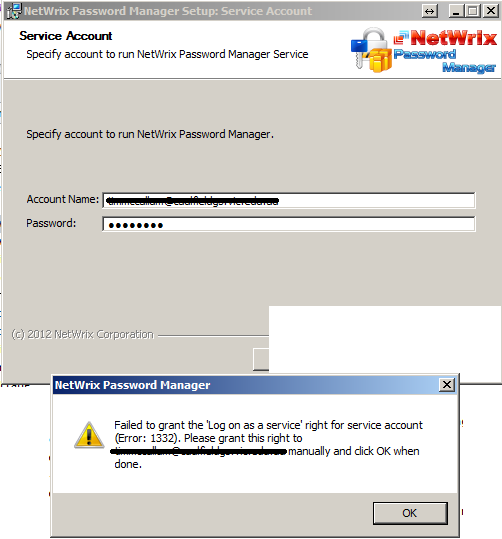
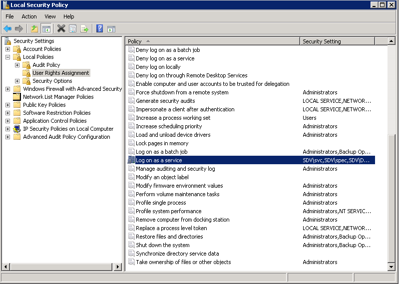

# Failed to grant "Log on as a service" right

During product installation you are asked to specify credentials to run the software.

But you receive the "Failed to grant the "Log on as  a service" right to the service account" error.

---

Password Manager is based on a service.

The service should run under an account with appropriate rights to perform required operations.

However the service account also should be allowed to run services. The right is called "Log on as a service" and can be granted via Local security policy.

---

## Resolution

To grant the "Log on as a service" rights please:

1. Run `secpol.msc`
2. In the left pane navigate to **Security Settings - Local policies - User rights assignment**
3. Double-click the **Log on as a service** entry in the right pane and add the account you want the service to run under
4. Click **OK** to apply

