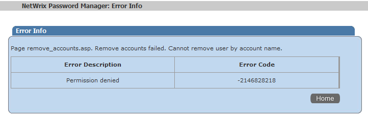
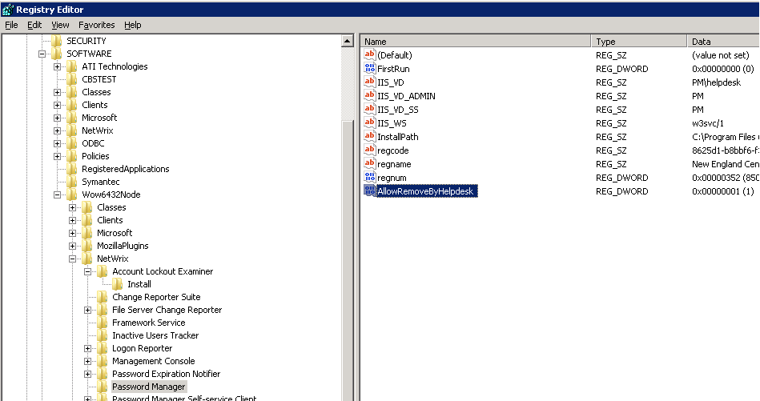

# HelpDesk operators cannot remove accounts

Helpdesk Operators cannot remove accounts from the list — when they attempt to remove an account, they receive an error message — `Permissions denied`.

---

It is by design — by default HelpDesk operators are not allowed to remove accounts. However this permission can be granted.

---

## Resolution

In order to grant the permission, perform the following steps:

1. Run **Registry Editor** (Start - Run, `regedit`).
2. Go to `HKLMSoftware[Wow6432Node]NetwrixPassword Manager` (Wow6432Node only for x64 OS).
3. Create DWORD `AllowRemoveByHelpdesk` with value of `1`.
4. Restart the **Netwrix Password Manager** service via **Services snap-in**.

