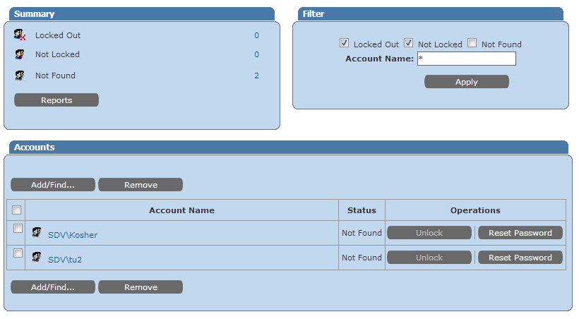
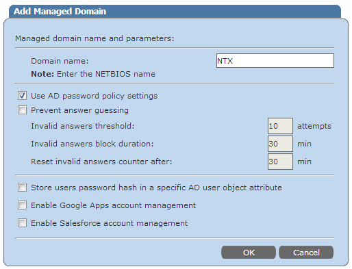

# Most users showing as Not found

## Symptom
On the Helpdesk portal statuses of users changes from **Not locked** to **Not found** and back after every page refresh.

---

## Cause
Password Manager refreshes users' statuses every 30 seconds. Such behaviour could occur if an LDAP request to AD returns that there are no users with such names.

It could be related to an invalid domain name.

---

## Resolution
1. Go to Administrative portals - **Domains**
2. Click **Edit** the corresponding domain
3. Make sure domain name is correct and is entered in `UPPERCASE`
4. Click **OK** to save changes

