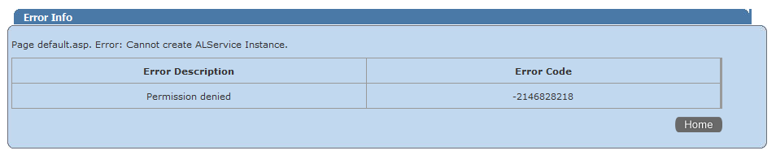

# Permission Denied Error

You may see this error when trying to browse to the **Helpdesk** or **Administrative** portal:

Such an error occurs when the account whose credentials are used to access the portal is not granted the appropriate security role.

Netwrix Password Manager uses a role-based security model. To access the **Help Desk** portal, the user must be granted the **Help Desk operators** role. To access the **Administrative** portal, the **Administrator** role is required.

Invalid authentication settings might also cause this error.

## To resolve the issue

1. Adjust product security roles.
   1. Go to the **Administrative portal - Roles** and make sure that the account or corresponding security group is granted the corresponding role.

   

2. Make sure that **Anonymous** authentication is NOT ENABLED for the **helpdesk** and **admin** virtual directories in the IIS Manager.

### To ensure the required settings are enabled in IIS6

1. In **IIS Manager** left pane, navigate to `\<your computer name>` - **Web Sites** - **Default Web Site** - **PM**.
2. Right-click the **helpdesk** (or **admin**) virtual directory under the **PM** folder and select **Properties**.
3. In the **Properties** dialog, open the **Directory Security** tab, and select **Edit** for **Authentication and access control**.
4. In the **Authentication Methods** dialog, enable either the **Integrated Windows authentication** box or **Basic authentication** (password is sent in clear text), and clear all other authentication options for Authentication access.

### To ensure the required settings are enabled in IIS7

1. In **IIS Manager** left pane, navigate to `\<your computer name>` - **Web Sites - Default Web Site - PM** - **helpdesk** (or **admin**).
2. In the Manager central pane, double-click the **Authentication** option under the **IIS** block.
3. In the **Authentication** list, enable either **Windows Authentication** or **Basic Authentication**, and disable all other authentication options.

  
