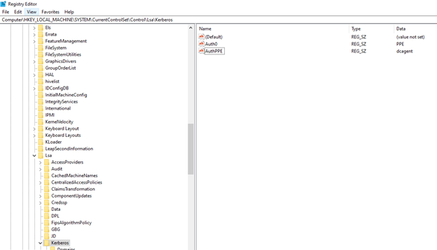

# SubAuthentication Filter Event Warning When Fortinet Is Installed

## Symptoms

Event ID 2060 for Netwrix Password Policy Enforcer (PPE) is found in the event logs when PPE and Fortinet are both installed on Domain Controllers: 
Event ID 2060 (Warning)
Netwrix Password Policy Enforcer is not prompting users to change passwords that are approaching their expiry date because another application has installed its own subauthentication filter. You can configure the app to use both filters concurrently.

## Cause

Fortinet removes PPE from the Subauthentication Filter found in registry location HKEY_LOCAL_MACHINE\SYSTEM\CurrentControlSet\Control\Lsa\Kerberos\ called "Auth0". 

## Resolution

Only the maximum age rule of PPE uses the Subauthentication Filter (Auth0) to display the "Your password expires in [n] days" notification on the client computer. This does not rely on the PPE client, PPE sets the password expiry time in the Kerberos ticket on the Domain Controller. PPE does not use the subauthentication filter for any rule enforcement, Alternatively, use Windows to enforce the maximum age or configure PPE reminder emails.

To restore the password expiry reminder when PPE and Fortinet are both installed, make the following registry edits:
1.	Open RegEdit to the HKEY_LOCAL_MACHINE\SYSTEM\CurrentControlSet\Control\Lsa\Kerberos\ key
2.	Verify that the Auth0 registry value reads dcagent

	

3.	Set the Auth0 value to PPE

	

4.	Create a new value of type REG_SZ called AuthPPE and set it to dcagent

	

5.	Restart the Domain Controller
