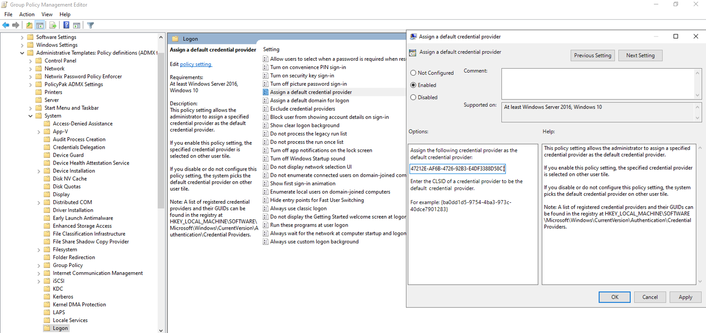

# Smart Card Reader As Default Logon Method After Client Installation

## Symptom

After installing Netwrix Password Policy Enforcer, the logon method has changed to Smart Card instead of Username and Password for Windows. 

## Cause

When Password Policy Enforcer Client is installed, Microsoft Windows may set Smart Card as the default credential provider instead of Password Policy Enforcer Client. This is a Windows credential provider stack behavior that does not occur on every machine.

## Resolution

Both options achieve the same result—they change the default credential provider from Smart Card to Password Policy Enforcer Client. 
- Option 1: Use if your organization uses Group Policy. 
- Option 2: Use if your organization does not use Group Policy — deploy the registry change using your organization's standard method for pushing registry values.

After applying either option, the default logon method on the Windows logon screen will change from Smart Card to Username and Password.

### Option 1 — With Group Policy

1. Open **Group Policy Management** by running `gpmc.msc` and select a GPO to edit that applies to the affected machines.
2. Set the `Assign a default credential provider` setting in `Computer Configuration >> Policies >> Administrative Templates >> System >> Logon` to `{F347212E-AF6B-4726-92B3-E4DF3388D58C}` and save.

### Option 2 — Without Group Policy
1. Open **Registry Editor** (`regedit`) on the affected machine.
2. Navigate to registry location `Computer\HKEY_LOCAL_MACHINE\SOFTWARE\Policies\Microsoft\Windows\System`. 
3. Edit or create a `Regular String` value named `DefaultCredentialProvider` and set it to `{F347212E-AF6B-4726-92B3-E4DF3388D58C}`.

This may require a reboot to take effect.

> **NOTE:** You may also want to disable the Smart Card credential provider if it is not in use on the machine.
>
> - **With Group Policy:** Set the `Exclude credential providers` setting in `Computer Configuration >> Policies >> Administrative Templates >> System >> Logon`. Use GUID `{8FD7E19C-3BF7-489B-A72C-846AB3678C96}` for Microsoft's Smart Card Credential Provider, or your third-party Smart Card credential provider's GUID if applicable.
> - **Without Group Policy:** Create a `Regular String` value named `ExcludedCredentialProviders` in `Computer\HKEY_LOCAL_MACHINE\SOFTWARE\Policies\Microsoft\Windows\System` and set it to the GUID to exclude.

