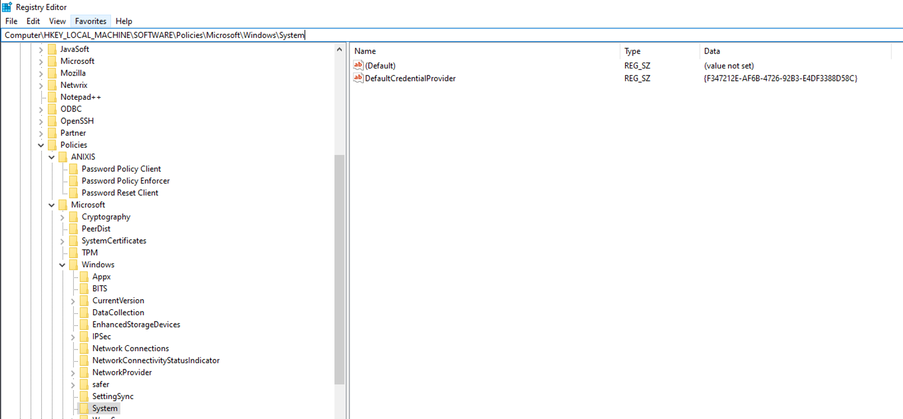
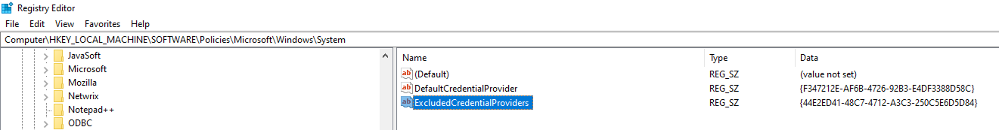

# Smart Card Reader As Default Logon Method After Client Installation

## Symptom

After installing Netwrix Password Policy Enforcer, the logon method has changed to Smart Card instead of Username and Password for Windows. 

## Cause

Microsoft Windows sets the default credential provider to Smart Card rather than Password Policy Enforcer Client.

## Resolution

Both options achieve the same result: they disable Password Policy Enforcer Client during logon by writing the same registry values. 
- Use Option 1 if your organization uses Group Policy. 
- Use Option 2 if your organization does not use Group Policy — deploy the registry change using your organization's standard method for pushing registry values.

After applying either option, the default logon method on the Windows logon screen will change from Smart Card to Username and Password.

### Option 1 — With Group Policy

1. Open Group Policy Management by running GMPC.MSC and select a GPO to edit that applies to the affected machines
2. Set the `Assign a default credential provider` GPO in `Computer Configuration >> Policies >> Administrative Templates >> System >> Logon` with setting `Assign a default credential provider`. Set it to Password Policy Enforcer Client’s GUID of  `{F347212E-AF6B-4726-92B3-E4DF3388D58C}` and save.

### Option 2 — Without Group Policy
1. Open Registry Editor (`regedit`) on the affected machine.
2. navigate to registry location `Computer\HKEY_LOCAL_MACHINE\SOFTWARE\Policies\Microsoft\Windows\System`. 
3. Edit or create a `Regular String` value named `DefaultCredentialProvider` and set it to `{F347212E-AF6B-4726-92B3-E4DF3388D58C}`.

This may require a reboot to take effect.

> **NOTE:** You may also want to disable the smartcard credential provider if it is not in use on the machine. Set the `Exclude credential providers` GPO in the same `Computer Configuration >> Policies >> Administrative Templates >> System >> Logon` path. The GUID you most likely need to use is `{8FD7E19C-3BF7-489B-A72C-846AB3678C96}`, which is Microsoft's Smartcard Credential Provider. If you have a third-party Credential Provider that does smartcard logons, then you will need that products appropriate GUID. If you're not using GPO and editing registry directly, you can create a `Regular String` value called `ExcludedCredentialProviders` with the value of the GUID to exclude in registry location `Computer\HKEY_LOCAL_MACHINE\SOFTWARE\Policies\Microsoft\Windows\System`.

