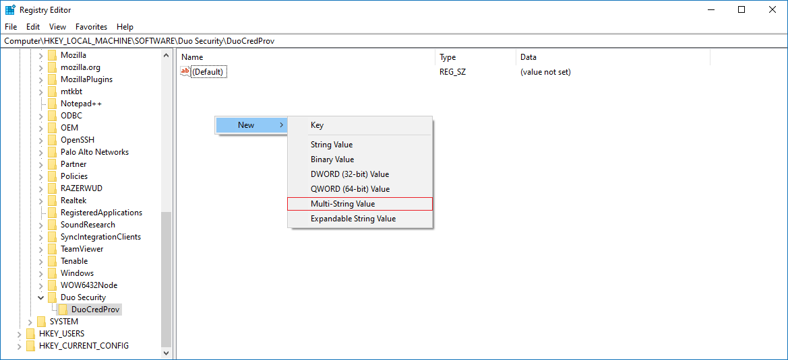
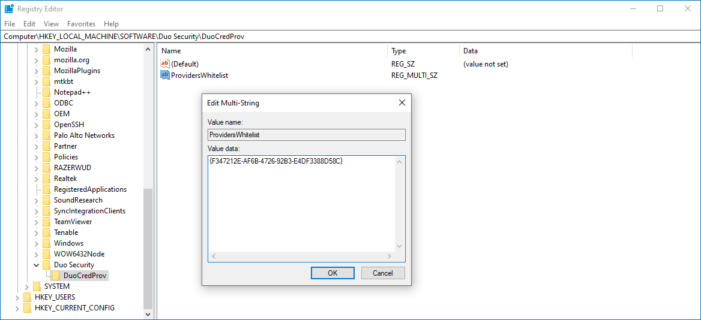

# Set Up Netwrix Password Policy Enforcer to Work with Cisco DUO Authentication

## Question

How to set up Netwrix Password Policy Enforcer to work with Cisco DUO Authentication?

## Answer

Refer to the following steps to set up Netwrix Password Policy Enforcer with Cisco DUO Authentication on a client:

1. In the client, open **Registry Editor** and follow the specified path:

   ```
   Computer\HKEY_LOCAL_MACHINE\SOFTWARE\Duo Security\DuoCredProv
   ```

2. Check if you have the `ProvidersWhitelist` value available in the key. If not, right-click the **DuoCredProv** key, and select **New** > **Multi-String Value**. Name the value **ProvidersWhitelist**.

   

3. Once created, right-click the value and select **Modify**. Input the Netwrix Password Policy Enforcer client GUID in the **Edit Multi-String** window:

   ```
   {F347212E-AF6B-4726-92B3-E4DF3388D58C}
   ```

   

4. Save the changes, and reboot the client to verify the changes.

Learn more in Can I enable other credential providers after installing Duo Authentication for Windows Logon? ⸱ Cisco DUO:  
https://help.duo.com/s/article/4041?language=en_US#:~:text=Installing%20Duo%20disables%20all%20other,last%20used%20credential%20provider%20GUID

> **IMPORTANT:** If the Netwrix Password Policy Enforcer–specific GUID does not work, you can try to use the GenericProvider GUID instead:
>
> ```
> {25CBB996-92ED-457e-B28C-4774084BD562}
> ```

## Related articles

- Can I enable other credential providers after installing Duo Authentication for Windows Logon? ⸱ Cisco DUO: https://help.duo.com/s/article/4041?language=en_US#:~:text=Installing%20Duo%20disables%20all%20other,last%20used%20credential%20provider%20GUID
