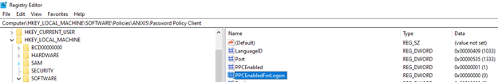

# RSA MFA Bypass When Password Policy Client Is Installed

## Symptoms

When Netwrix Password Policy Enforcer Client is installed on endpoints with RSA MFA, users can bypass RSA MFA by allowing users to log in to the machine using username and password.

## Cause

By default, the Windows Logon Screen calls Password Policy Enforcer Client, which uses username and password logon and may conflict with how RSA MFA operates.

## Resolution

Option 1:
Use the "Enable Password Policy Client for Logon usage scenario" option in the Password Policy Enforcer Client Administrative Template (ADMX) for GPO and set it to "Disabled".

> **NOTE:** For the Password Policy Enforcer Client ADMX Template, see [Configuring the password policy client 🡥](https://docs.netwrix.com/docs/passwordpolicyenforcer/11_2/admin/password-policy-client/configuring_the_password_policy_client).

Option 2:
Edit or create the Registry DWORD "PPCEnabledForLogon" and set it to "0" at Computer\HKEY_LOCAL_MACHINE\SOFTWARE\Policies\ANIXIS\Password Policy Client on the affected machines. This may require a reboot to take effect.

