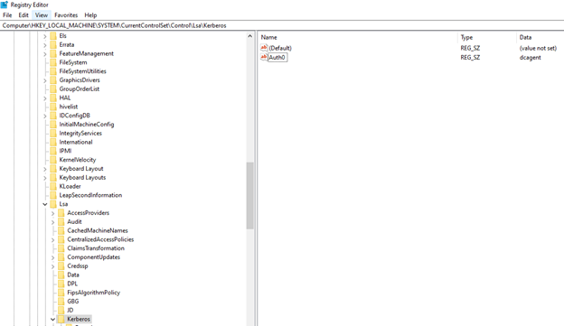
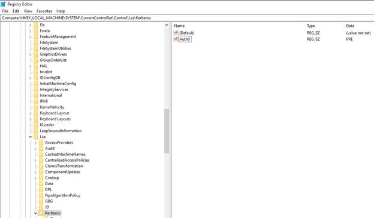

# SubAuthentication Filter Event Warning When Fortinet Is Installed

## Symptom

Event ID 2060 appears in the event logs when Netwrix Password Policy Enforcer (PPE) and Fortinet are both installed on the same Domain Controllers:

```
Event ID 2060 (Warning)
Netwrix Password Policy Enforcer is not prompting users to change passwords that are approaching their expiry date because another application has installed its own subauthentication filter. You can configure the app to use both filters concurrently.
```

## Cause

Fortinet removes PPE from the SubAuthentication Filter value (`Auth0`) in the following registry key:
- `HKEY_LOCAL_MACHINE\SYSTEM\CurrentControlSet\Control\Lsa\Kerberos\`. 

This prevents PPE from informing Windows to display password expiry notifications on the client computer. 

## Resolution

Only the maximum age rule of PPE uses the SubAuthentication Filter (`Auth0`) to display the **Your password expires in [n] days** notification on the client computer. PPE sets the password expiry time in the Kerberos ticket on the Domain Controller and does not rely on the PPE client. PPE does not use the subauthentication filter for any rule enforcement.

> **NOTE:** Alternatively, use Windows to enforce the maximum age or configure PPE reminder emails.

To restore the password expiry reminder when PPE and Fortinet are both installed, make the following registry edits:

1.	Open `RegEdit` to key: `HKEY_LOCAL_MACHINE\SYSTEM\CurrentControlSet\Control\Lsa\Kerberos\`.
2.	Verify that the `Auth0` registry value reads `dcagent`.

	

3.	Set the `Auth0` value to `PPE`.

	

4.	Create a new value of type `REG_SZ` called `AuthPPE`, and set it to `dcagent`.

	

5.	Restart the Domain Controller.
