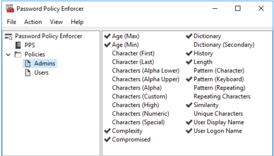

# PPE Management Console

The Netwrix Password Policy Enforcer (PPE) management console is a Microsoft Management Console snap-in that is used to edit PPE's configuration. The management console is installed by default when PPE is installed, but you can also install it on your computer if you want to remotely configure PPE.

## Installing the Management Console

To install the PPE management console onto your computer so that you can remotely configure PPE:

1. Start the Netwrix Password Policy Enforcer (PPE) installer (`PPE912.exe`).
2. Read the license agreement, and then click **Yes** if you accept all the license terms and conditions.
3. Select the **Advanced** option, and then click **Next**.
4. Double-click the `PPE912.msi` file.
5. Click **Next** when the PPE Installation Wizard opens.
6. Select **I accept the license agreement**, and then click **Next**.
7. Select the **Custom** option, and then click **Next**.
8. Click the icon beside the **Password Policy Server** feature, and then click **Entire feature will be unavailable**.
9. Click **Next** twice.
10. Wait for the management console to install, and then click **Finish**.

## Opening the Management Console

Click **Start > Netwrix Password Policy Enforcer 9 > PPE Configuration** to open the PPE management console. If you are opening the management console for the first time, then click **Yes** when asked if you would like to create a new PPE configuration.

The management console images in this document are taken from a computer running Windows Server 2016. Other Windows versions may display the management console slightly differently; however, the management console is used identically on all Windows versions.

Press F1 while using the management console to display help information for the current window.

## Management Console Views

The PPE management console has four views. Click an item in the left pane of the management console to select a view.

### PPE View

Click **Netwrix Password Policy Enforcer** in the left pane to display this view.

Use this view to:
- Read the Netwrix Password Policy Enforcer documentation.
- Connect to a configuration.

### PPS View

Click **PPS** in the left pane to display this view.

Use this view to:
- Edit **PPS** properties.
- Connect to a configuration.
- Display the **Support Tools** page.

### Policies View

Click **Policies** in the left pane to display this view.

Use this view to:
- Edit policy properties.
- Test policies.
- Create and delete policies.
- Set policy priorities.

### Rules View

Click a policy name in the left pane to display this view. Use this view to configure the rules for a policy.
