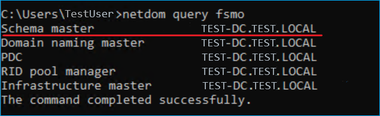
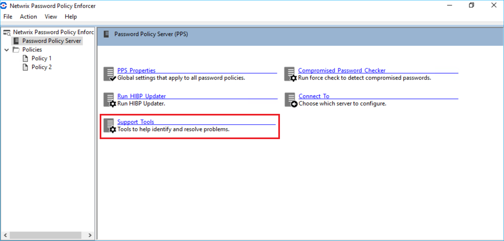
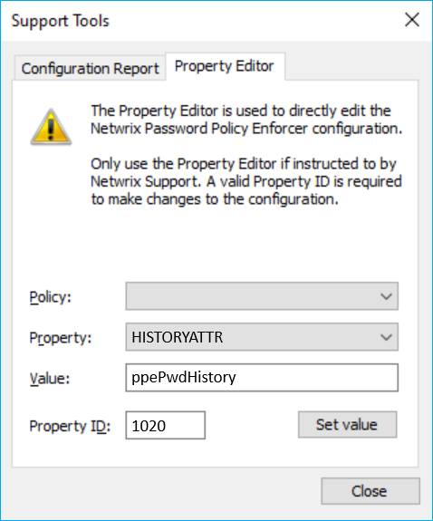

# Storing Password History in Netwrix Password Policy Enforcer

## Question

How to set up Netwrix Password Policy Enforcer (PPE) to store the password history in an existing attribute?

## Answer

> **IMPORTANT:** While this article covers the use of an existing attribute for the password storage, you can use a newly created attribute. There are 2 distinct benefits when using a new attribute:
>
> 1. The new attribute won't be used by any other application.
> 2. The new attribute can be marked as **Confidential** in Active Directory.
>
> This article covers the use of the **ppePwdHistory** attribute created by PPE and marked **Confidential** by default. Alternatively, you can use an existing atribute not used by other applications, e.g. **desktopProfile**. Learn more about the `desktopProfile` attribute in Desktop-Profile attribute ⸱ Microsoft: https://learn.microsoft.com/en-us/windows/win32/adschema/a-desktopprofile

### Prerequisites

- Perform the steps on your schema master domain controller.
- The account used to perform the steps must be a member of the **Domain Admin** group.
- If you use a custom attribute, it must be a single-valued attribute with one of these syntaxes: octet string, printable string, IA5 string, or Unicode string. It should also allow long strings — possibly as long as `5411` characters to store 100 hashes.

Refer to the following steps to discover the schema master domain controller in your environment:

1. On any domain controller in your environment, run the following command in an elevated Command Prompt to get a list of Flexible Single Master Operation (FSMO) roles in Active Directory:
```text
netdom query fsmo
```
2. Review the list of FSMO roles to find the schema master domain controller (see the screenshot for reference).



### Setup

Refer to the following steps to configure the password history attribute:

1. On your schema master domain controller, open the PPE configuration console.
2. In the **Password Policy Server** tab, select **Support Tools**.



3. Select the **Property Editor** tab.
4. Select the `HISTORYATTR` value in the **Property** drop-down list. Specify the `ppePwdHistory` or other attribute value in the **Value** field. Specify `1020` in the **Property ID** field. Click **Set value** to save changes.



PPE will now store the password history in the attribute you selected. Because authenticated users can read standard attributes of other users, you should change the Active Directory permissions for the existing attribute to prevent users from reading the hashes (password history) of other users. This is required when you use existing attributes. The `ppePwdHistory` attribute created for PPE is protected by default.

You can also implement the **Enforce password history** policy to avoid making changes in Active Directory. Learn more in Enforce password history ⸱ Microsoft: https://learn.microsoft.com/en-us/windows/security/threat-protection/security-policy-settings/enforce-password-history

### Related articles

- Desktop-Profile attribute ⸱ Microsoft: https://learn.microsoft.com/en-us/windows/win32/adschema/a-desktopprofile
- Enforce password history ⸱ Microsoft: https://learn.microsoft.com/en-us/windows/security/threat-protection/security-policy-settings/enforce-password-history
