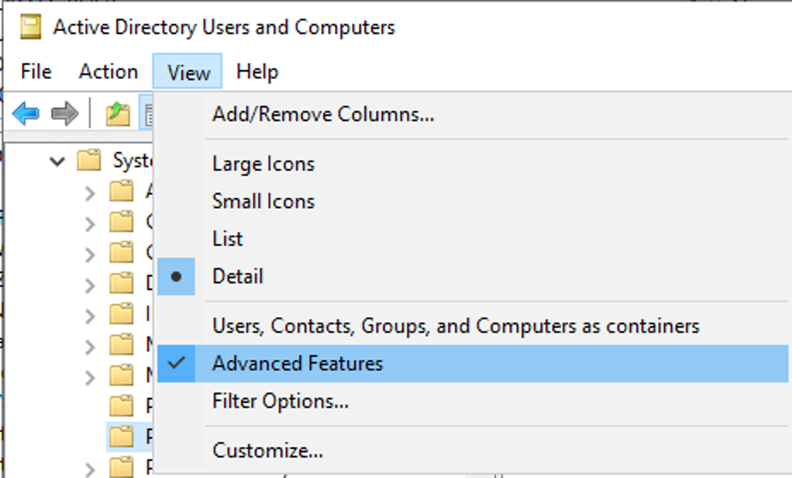
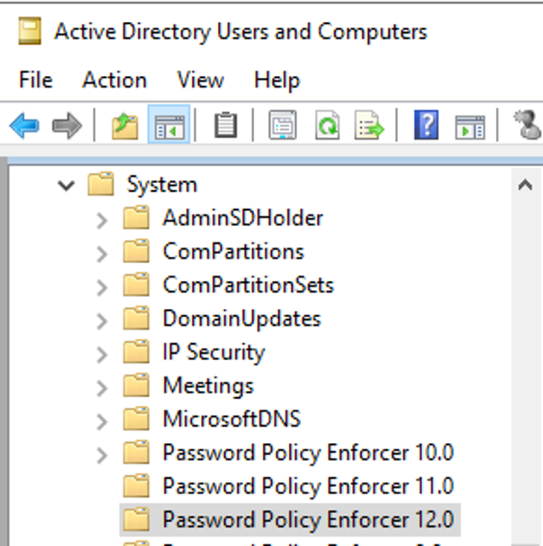

# Error: Cannot Write the App Configuration Settings (Access Denied)

## Symptom

When attempting to save a configuration change in Netwrix Password Policy Enforcer a “Cannot write the app configuration settings (access denied)” error occurs.  

## Cause

The account currently using the Password Policy Enforcer Management Console does not have sufficient rights to edit the object in Active Directory. 

## Resolution

Ensure that the account you use to run the Password Policy Enforcer Management Console has Read and Write permissions on the object in Active Directory where the Password Policy Enforcer configuration is stored. A Deny permission on the object — for the account itself or a group it belongs to — blocks access even when an Allow permission is also present, so remove any Deny permissions if they are not intentional.

1. Open Active Directory Users and Computers.

2. Click **View**, then select **Advanced Features**.

3. Locate the Password Policy Enforcer object for the version you are using under the System directory.

    > **NOTE:** The version of the object changes only with the major version number; it does not change for minor version numbers or build numbers.

4. Right click on the Password Policy Enforcer object of your version and click **Properties**, then click the **Security** tab to view all the permissions applied to this object. Grant the account Read and Write permissions, and remove any Deny permissions that are blocking access.

5. Reopen the Password Policy Enforcer Management Console and retry saving the configuration change. The save should now complete without the access denied error.