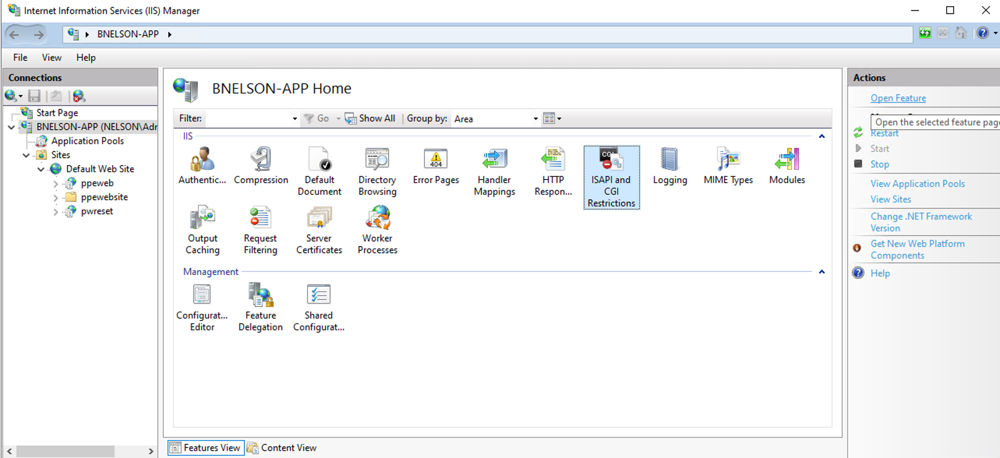
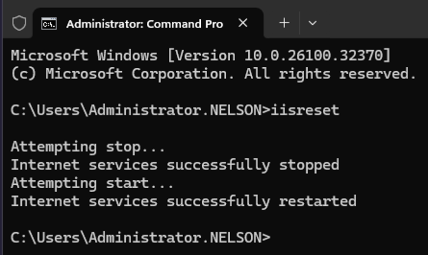
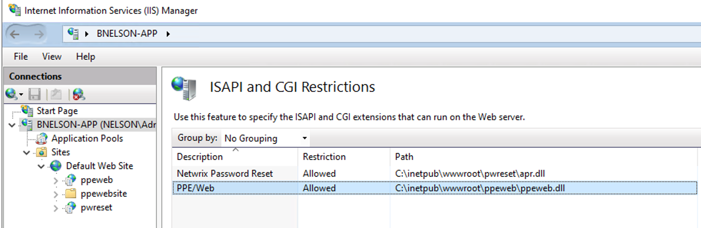
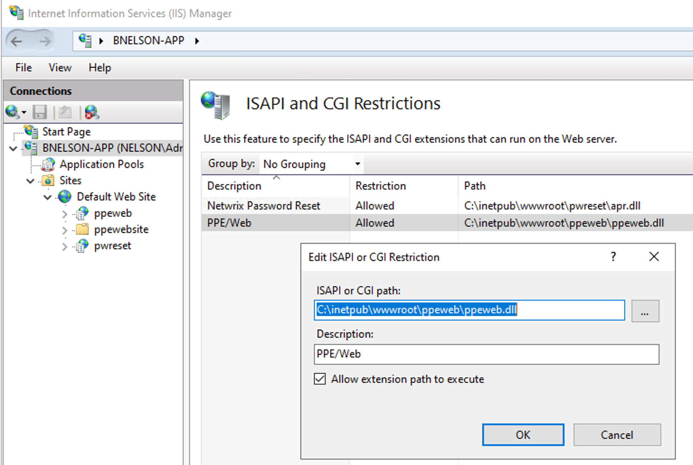

# PPEWeb Downloads DLL File When Using Web GUI

## Symptom

When you attempt to load a page, Netwrix Password Policy Enforcer Web downloads PPEWeb.dll instead.

## Cause

The IIS server role does not include Internet Server API (ISAPI) Extensions, and the ISAPI and CGI Restrictions feature in IIS Manager does not list PPEWeb.dll as an allowed entry.

## Resolution

1. Open Server Manager on the server hosting IIS:
   1. press Windows Key + R
   2. type "servermanager" in the open field and click OK
2. In Server Manager click "Manage" and click "Add Roles and Features"

3. In **Before You Begin**, **Installation Type**, and **Server Selection**, accept the defaults and click **Next**.
   1. On **Server Roles**, expand **Web Server (IIS)** > **Web Server** > **Application Development** and select **ISAPI Extensions**.
   2. Complete the wizard to install. If IIS already includes ISAPI Extensions, continue to the next step.

4. Close IIS Manager if it is open, then run `iisreset` from a command prompt.

5. Open IIS Manager and navigate to the server name in the **Connections** pane. In **Features View**, select **ISAPI and CGI Restrictions**.

6. In **ISAPI and CGI Restrictions**, locate **PPEWeb**. Set the restriction to **Allowed** and set the path to PPEWeb.dll.

7. If PPEWeb.dll does not appear in the list, use **Add** or **Edit** in the **Actions** pane. Enter the path to PPEWeb.dll, add a description to identify the entry, and select **Allow extension path to execute**.

8. Close IIS Manager and run `iisreset` from a command prompt.

9. Clear the browser cache. Verify that clicking **Change Password** in the web GUI loads the change password page instead of downloading PPEWeb.dll.