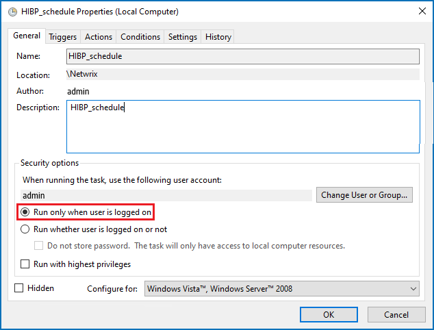

# User Not Logged-On Warning During HIBP Updates

## Symptoms

- The weekly HaveIBeenPwned (HIBP) database update fails.
- Netwrix Password Policy Enforcer prompts the following warning in the schedule history:

```
Launch condition not met, user not logged-on
```

The warning includes the following description:

```
Task Scheduler did not launch task "\Netwrix\%task_name%" because user "%user_account%" was not logged on when the launching conditions were met.
User Action: Ensure user is logged on or change the task definition to allow launching when user is logged off.
```

> **NOTE:** Refer to the following steps to review the schedule history:
>
> 1. In the Netwrix Password Policy Enforcer window, select **Action** and click the **Run HIBP Updater** button.
> 2. Click the **Scheduler** button.
> 3. Select a schedule from the list and click **Edit schedule**.
> 4. In the right pane, click the **History** button.

## Cause

The **Run only when user is logged in** feature is enabled in the scheduled task to update the HIBP database. The corresponding user is not logged in during the weekly HIBP database update attempt.



## Resolution

Switch the radio button to the **Run whether user is logged on or not** option in the Task Scheduler task.

1. On the Netwrix Password Policy Enforcer server, launch Task Scheduler.
2. In the left pane, extend the **Task Scheduler Library** folder and select the **Netwrix** folder.
3. In the central view, select the Netwrix Password Policy Enforcer task, right-click it, and select **Properties**.
4. In the Properties window, switch the security option to the **Run whether user is logged on or not** option.

> **NOTE:** Alternatively, you can change the designated user to keep the **Run only when user is logged in** feature on. To change the user, click the **Change User or Group...** button in the **Properties** window. Specify the new user.
