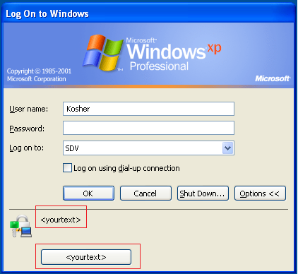
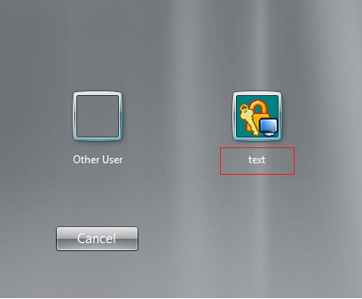

# Customization of Logon Prompt Extension

## Overview

Customization of the Netwrix Logon Prompt Extension for Netwrix Password Reset is done via registry values in the following keys:

- `HKEY_LOCAL_MACHINE\SOFTWARE\[Wow6432Node]\NetwrixPassword Manager Self-service Client`
- `HKEY_LOCAL_MACHINE\SOFTWARE\[Wow6432Node]\Policies\NetwrixPasswordManager`

Most of these values are not created by the default installation. You can set values manually or by using any deployment software that can apply `.reg` files (SCCM, self-written scripts, etc.). The `Policies` key can also be configured via Group Policy by using the `Netwrixprm.adm` administrative template, which is located in the Netwrix Password Reset installation directory — it is described in the Administrator's guide.

The full list of values follows.

---

## At `HKEY_LOCAL_MACHINE\SOFTWARE\[Wow6432Node]\NetwrixPassword Manager Self-service Client`

All values are string values (`REG_SZ`):

- `CompanyBrand` — this value replaces "Netwrix" in all text of the Logon Prompt Extension
- `HelpDeskPhone` — this value is added at the end of all message boxes in the Logon Prompt Extension and Enrollment wizard
- `LogonCaption` — this value replaces the header of the Logon Prompt Extension password reset wizard
- `MainCaption` — this value replaces the header of the Enrollment wizard

---

## At `HKEY_LOCAL_MACHINE\SOFTWARE\[Wow6432Node]\Policies\NetwrixPasswordManager`

String values (`REG_SZ`):

- `PRM_Server` — URL to your Password Manager web site
- `PRM_LogonWindowText` — replaces text of the LPE invite on WinXP/2003 logon screen
- `PRM_LogonWindowButtonText` — replaces text which is shown when you point to the button of the Logon Prompt Extension on the WinXP/2003 logon screen
- `PRM_LogonWindowIconPath` — contains path to an `.ico` file, with which the default icon of the Logon Prompt Extension will be replaced
- `PRM_CredProvLogonWindowText` — replaces text of the Logon Prompt Extension invite on WinVista/7/2008 logon screen
- `PRM_CurrentUserLanguage` — this value toggles the language of the Logon Prompt Extension and Enrollment wizard. Possible values are specified in the table below.
- `PRM_CredentialDialogText` — replaces the text in the credential prompt window of the Enrollment wizard
- `PRM_CredentialDialogCaption` — replaces the header in the credential prompt window of the Enrollment wizard
- `LPE_AccountRemark` — replaces the example text under the field used to enter the account name
- `Predefine_Domain` — this value sets a predefined domain name that will be used

### DWORD values

DWORD values can be turned on (`1`) or off (`0`):

- `PRM_ResetCredentialsCache` — allows the client to reset password in the local cache in disconnected mode.
- `PRM_SuppressEnrollmentErrors` — this option disables error messages
- `PRM_SuppressLaterEnrollment` — this option makes the user unable to close the Enrollment wizard without completing the enroll procedure

---

## Language values

Set `PRM_CurrentUserLanguage` to one of the following values:

| Value | Language             |
|-------:|---------------------|
| cn    | Chinese              |
| de    | German               |
| en    | English              |
| es    | Spanish              |
| fr    | French               |
| he    | Hebrew               |
| it    | Italian              |
| jp    | Japanese             |
| ko    | Korean               |
| pt    | Portuguese           |
| ru    | Russian              |
| sk    | Slovak               |
| zh    | Traditional Chinese  |

