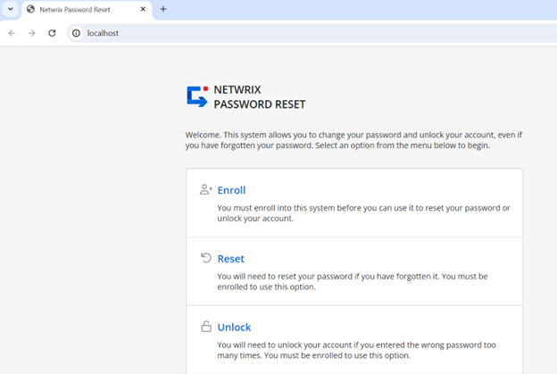

# How to Configure Website Accessibility Using Server Hostname Only

## Question

How can you get Netwrix Password Reset to redirect a site to its hostname?

## Answer

Follow the steps below to configure Netwrix Password Reset to redirect a site to its hostname:

1. Open **IIS Manager**.

2. Select **Default web site** and click **Advanced Settings...** in the right pane.

   
