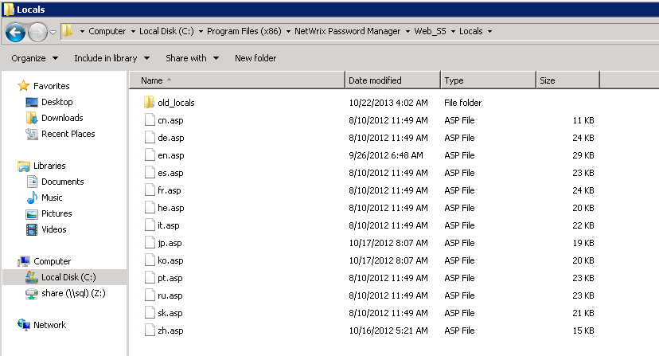

# How to localize Netwrix Password Reset

There is an option to select the language of the **Self-Service portal**, but there is no language you need in the list. How can you add the language you need to the list?

Each language has a separate localization file.

## Location of localization files

Localization files are stored in the **Web_SSLocals** folder in the program installation directory (by default - `C:\Program Files (x86)\Netwrix Password Manager\Web_SSLocals`)

To add a language, create a copy of `en.asp`, then rename it to `%language code%.asp` and edit.

### Required settings in the new file

1. Open the new `%language code%.asp` file.
2. First of all set:
   - `strLangID=`%language code%`  (NOTE: Must correspond with the asp file name)`
   - `strLangDispName=`%language name%``

3. Then substitute all English phrases with their equivalents in the desired language.
4. After you finish, save changes and execute `iisreset` from the command line.

The language will be added to the list automatically.

Also take a look at https://kb.netwrix.com/659 for more details about localization files.
