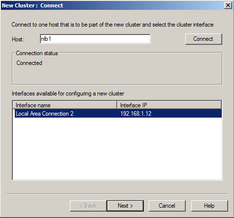
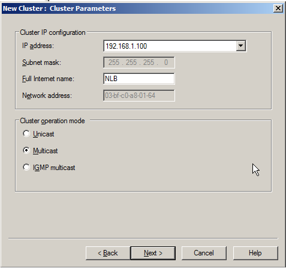

# Load-balancing cluster for Netwrix Password Reset

How to setup a load balancing cluster for Netwrix Password Reset

**Note:** Load-balancing can be used for the frontend only. It is impossible to load-balance a single-server installation, because in this case there will be several copies of the Password Manager service running at the same time and you will not be able to share the internal database of Password Manager between them.

**Note:** A load-balanced cluster can be built both with domain or non-domain members; however the best practice is to use domain members as cluster nodes. The instruction below refers to creating a load-balancing cluster with domain members.

1. Enable the **Network Load Balancing** feature (only available in Windows 2008 R2 Datacenter and Enterprise)
   1. Run **Server Manager**
   2. In the left pane right-click **Features**, select **Add feature**. A wizard opens.
   3. Enable the checkbox in front of **Network Load Balancing**, click **Next**, then click **Install**.

2. On any server that has the Network Load Balancing feature installed, run **Control Panel → Administrative Tools → Network Load Balancing Manager**
   1. From the menu select **Cluster → New**
   2. In the **Host** field specify a name of a machine that is to be part of the new cluster, click **Connect**
   3. Select the network Interface that will be used to build a cluster, click **Next**

4. In the **New Cluster: Cluster IP addresses** window click **Add** and specify the IP address and subnet mask that will be used to access the cluster. Click **OK**, then **Next**.

5. In the **New cluster: Cluster Parameters** window verify cluster IP, specify cluster internet name and cluster operational mode. Click **Next.**

   **Note:** For servers with only one network interface set **Multicast.**

6. In the **New cluster: Port rules** window click **Finish**.

   **Note:** By default all traffic (on all protocols and ports) is equally divided between all cluster nodes. If you want to load-balance requests on a specific protocol or port, in the **New cluster: Port rules** window highlight the rule and click **Modify**.

7. Right-click the newly created cluster in the left pane and select **Add host to cluster** and add more nodes if needed.

8. Repeat steps 4-9 of this procedure for every server that is to be a cluster node.

9. Install Web-Applications on every node per procedure 12 of the Netwrix Password Reset Administrators guide:
   - https://www.netwrix.com/download/documents/NetWrix_Password_Manager_Administrator_Guide.pdf
