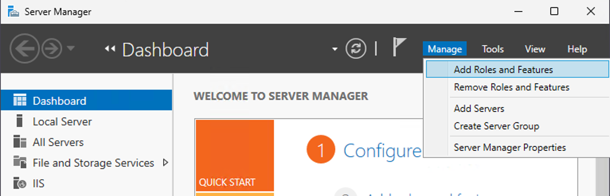
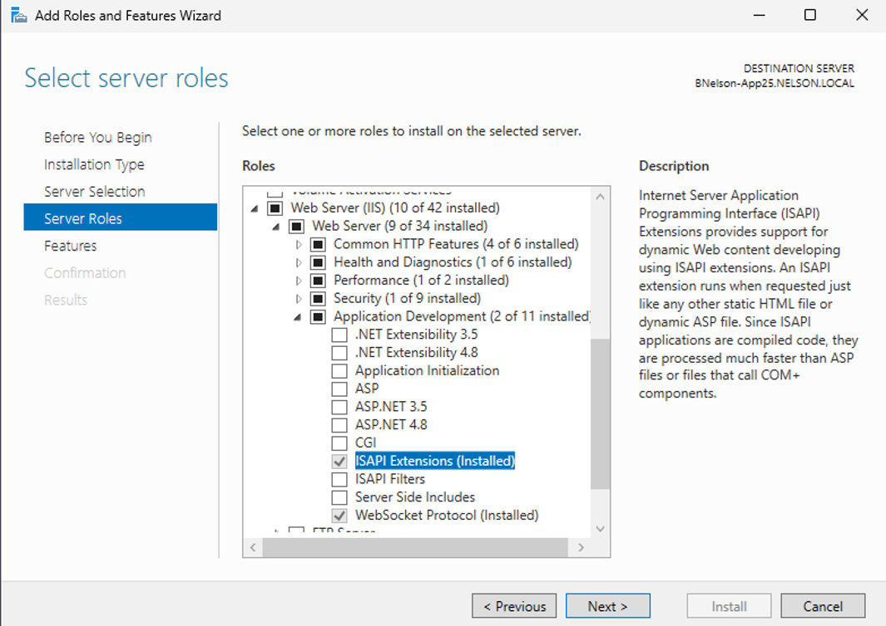
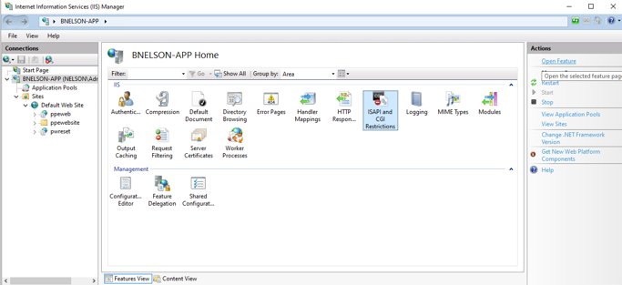
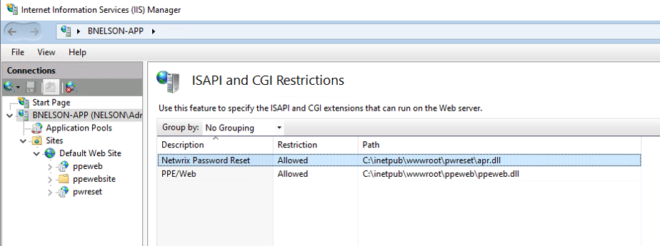
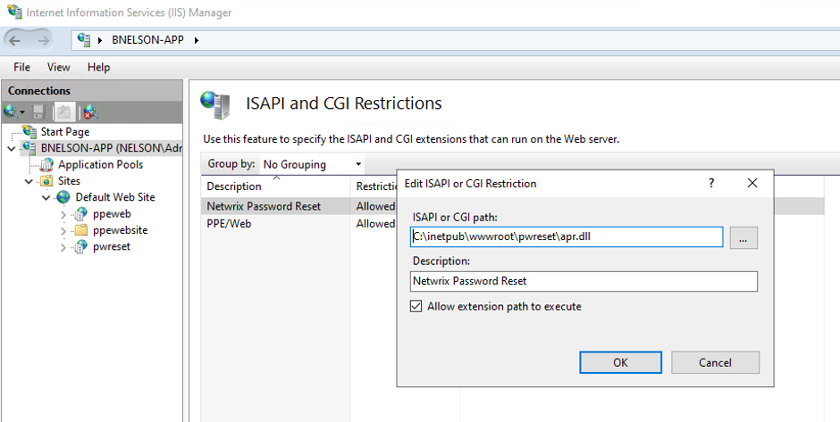

# Web GUI Downloads DLL File Instead of Loading Pages

## Symptom

When a user attempts to load any page, Netwrix Password Reset Webpage downloads `APR.dll` instead.

## Cause

The IIS server role does not include Internet Server API (ISAPI) Extensions, and the ISAPI and CGI Restrictions feature in IIS Manager does not list `APR.dll` as an allowed entry.

## Resolution

### Enable ISAPI Extensions

1. Open Server Manager on the server hosting IIS:
   - Press Windows Key + R.
   - Type `servermanager` in the open field and click **OK**.
2. In Server Manager click **Manage**, then click **Add Roles and Features**, which opens the Add Roles and Features Wizard.

3. In **Before You Begin**, **Installation Type**, and **Server Selection**, accept the defaults and click **Next**.
   - On **Server Roles**, expand **Web Server (IIS)** > **Web Server** > **Application Development** and select **ISAPI Extensions**.
   - Complete the wizard to install. If IIS already includes ISAPI Extensions, continue to the next step.

4. Close IIS Manager if it is open, then run `iisreset` from a command prompt.

### Allow APR.dll in ISAPI and CGI Restrictions

1. Open IIS Manager and navigate to the server name in the **Connections** pane. In **Features View**, select **ISAPI and CGI Restrictions**.

2. In **ISAPI and CGI Restrictions**, locate **Password Reset**. Set the restriction to **Allowed** and set the path to `apr.dll`.

3. If `apr.dll` does not appear in the list, use **Add** or **Edit** in the **Actions** pane. Enter the path to `apr.dll`, add a description to identify the entry, and select **Allow extension path to execute**.

4. Close IIS Manager and run `iisreset` from a command prompt.

### Verify the Fix

1. Clear the browser cache. 
2. Verify that clicking clicking a link in the web GUI loads the page instead of downloading `apr.dll`.