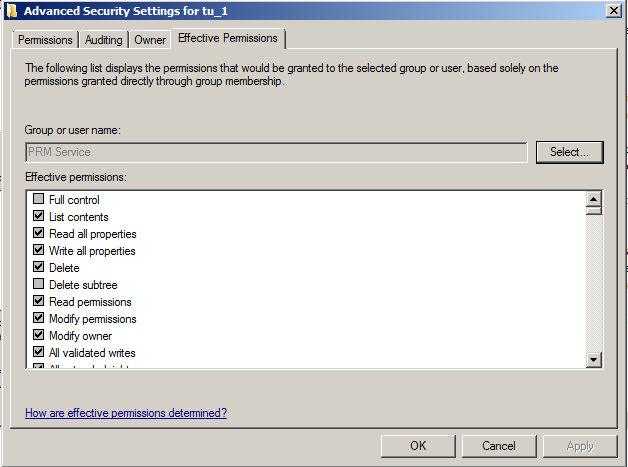
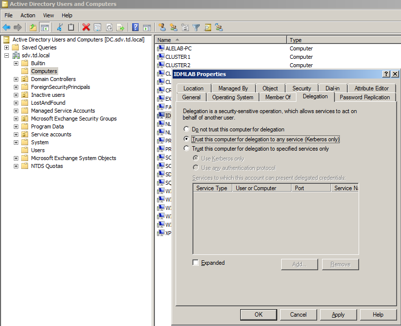

# Error: "No mapping between account names and security IDs was done"

## Symptoms
The following error message appears when trying to enroll a user, unlock a user account, change or reset a password:

```
No mapping between account names and security IDs was done when enrolling user, changing or resetting password
```

## Cause
Here are possible reasons:

- The user name is invalid. Make sure that the name is entered correctly and the account of this user name belongs to the specified domain.
- The service account does not have permissions to read account properties form AD
- The computer with Netwrix Password Manager installed is not trusted for delegation.
- The computer with Netwrix Password Manager installed cannot connect to a domain controller.

## Resolution
Verify all possible reasons mentioned above:

1. Check that a username is entered correctly and a user with such account name is present in AD
2. Check the effective permissions of the Password Manager service account ot the problem account

- Select test account in AD Users and Computers and go to **Properties - Security**
- Click **Advanced** and go to **Effective Permissions** tab
- Specify the name of the service account and check effective permissions



3. In Active Directory Users and Computers, open the required account`s **Properties** dialog, switch to the **Delegation** tab and select the **Trust this computer for delegation to any service (Kerberos only)** option.



4. Try to delete the computer from your domain and then add it back.
