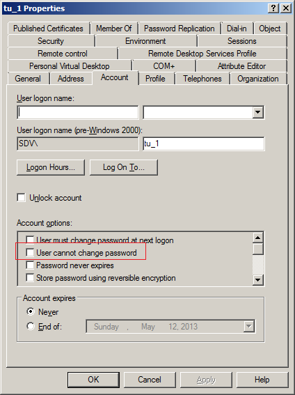

# Error: "Access Denied"  or "Insufficient permissions"

When a user tries to reset the password via Self-Service portal they receive  "Access Denied" error or "Insufficient permissions"

---

The error occurs when the Password Manager service account does not have enough permissions to perform the requested action.

---

To resolve the issue:

1. Make sure that the Password manager service account is a domain admin, or at least has [required permissions](https://kb.netwrix.com/1868).

   **NOTE**. A non-privileged service account is not able to unlock and reset passwords for protected domain groups (domain admins, enterprise admins, etc) because of AdminSDHolder Access control mechanism.

   AdminSDHolder is a container inside Active Directory that maintains a master list of permissions for objects that are members of privileged groups in Active Directory. Access control prevents access of non-privileged accounts to this container.

   Below are some of the protected groups that cannot be handled without domain admin rights:
   - Administrators
   - Domain Admins
   - Enterprise Admins
   - Schema Admins
   - Domain Controllers
   - Server Operators

   More information about it here:
   http://blogs.technet.com/b/askds/archive/2009/05/07/five-common-questions-about-adminsdholder-and-sdprop.aspx

   http://tsmith.co/2011/what-is-adminsdholder/

2. Make sure the user is allowed to change password:

   1. Start **Server Manager a**nd find the user account in **Active Directory Users and Computers**, right-click the user and select **Properties**.
   2. On the **Account** tab in the **Account options** list, make sure that **User cannot change password** is NOT selected.

   
