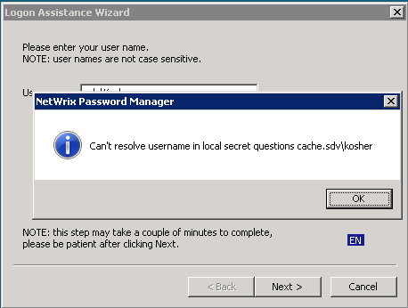
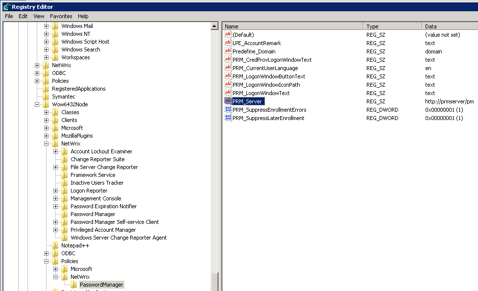

# Error: Can't resolve username in the local secret questions cache

## Symptoms

You see the following error in the client (logon prompt extension) after entering username and clicking **Next**:

---

## Cause

When a user enrolls from their machine using Password Manager Enrollment, a local copy of secret question-and-answer pairs is created on the machine.

This local questions cache is used to reset the password in the Windows local cache when the Password Manager server is not available.

The error occurs when the Logon Prompt Extension is not able to connect to the Password Manager server and cannot find the locally saved questions.

---

## Resolution

First, make sure that the client is pointed to the correct Password Manager Self-Service portal URL. It is determined by the `PRM_server` registry value located in the following registry keys (by priority):

1. `HKLMSoftware[Wow6432Node]PoliciesNetWrixPassword Manager`
2. `HKLMSoftware[Wow6432Node]NetWrixPassword Manager Self-Service client (is used if there is no value in the 1st key)`

- If the server URL value is correct, but the server is temporarily unavailable, the error is expected for users who enrolled via web.
- If you need an option to reset the password in disconnected mode, enroll through the Enrollment wizard locally from the machine.
