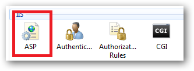
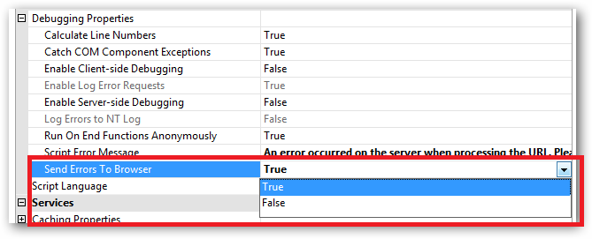

# An error occured on the server when processing the URL

When a user tries to browse to the self-service portal they receive an error message that an error occurred on the server when processing the URL.

---

The message is just a user-friendly screen indicating that something went wrong.

The most common reason is access permission issues. For example, if some files are unable to be read from disk.

---

## Resolution

1. Make sure that the Netwrix Password Reset service account is assigned local administrator permissions on the server.

2. If this does not help, turn on IIS error codes to be sent to the browser, disable user-friendly error messages, and review the exact error code.

## Configure sending of errors to browsers

1. Run IIS, and select the web site that Netwrix Password Reset is installed to.

   

2. Select the **ASP** feature in the central pane.

3. Expand **Debugging Properties** and set **Send errors to browser** to **True**.

   

## Disable user-friendly errors in Internet Explorer

Open the Microsoft TechNet article:
http://technet.microsoft.com/en-us/library/cc778248(v=ws.10).aspx

## Disable user-friendly errors in Firefox

1. Open a new tab (CTRL+T) or window (CTRL+N).
2. Type in the address bar: `about:config`.
3. In the filter bar type: `error` and press Enter.
4. Now set the value of the `browser.xul.error_pages.enabled` to `true`.
5. Restart Firefox.

## Notes about Chrome

Chrome automatically maintains friendly errors, and disables them for error messages bigger than 512 bytes in size. It is recommended to use Internet Explorer to view the error code.
