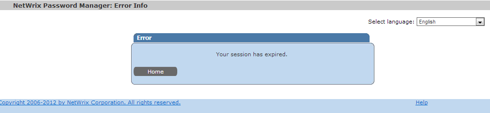

# Session expired

A user receives a Session expired message when trying to reset their password using the Self-Service portal.

## Cause

Netwrix Password Reset is based on IIS and uses internal IIS session variables to handle information. IIS session is limited and may expire. The default timeout is `20 minutes`.

This error can also occur when there are issues with cookies, for example when they do not correspond to the current session, or refer to another URL, etc.

## Resolution

1. First, make sure that it is not a real session expiration. If the user started the password reset procedure more than `20 minutes` ago, then this is an expected message.
2. Clear all cookies and try again.
3. If this does not help, check if there is an incorrect redirection in IIS.

Please refer to the [KB823](https://kb.netwrix.com/823) for instructions on how to set up redirection for Netwrix Password Reset.
