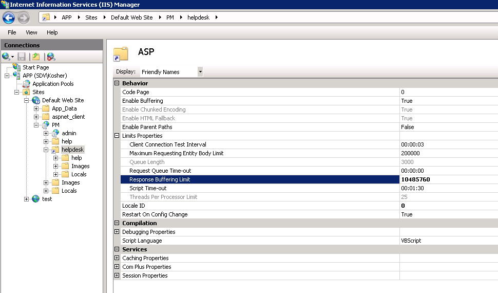

# Report could not be downloaded

While downloading a report from the Netwrix Password Reset Helpdesk portal, no error messages are displayed but the report can not be downloaded.

Reports are actually generated as html files. To make them available for download, Password Manager saves them in .csv format in the Helpdesk physical path folder (by default `C:\Program Files (x86)\Netwrix Password Manager\Web`)

If the time period (for the Activity Report) or Number of users in monitored domains are large, then report files might be several megabytes in size.

By default Internet Information Services has a 4 MB size limit for downloaded files, if the file is bigger than 4 MB, the error above might occur.

To resolve the issue you need to increase size limit.

In order to do it:

1. Launch **IIS Manager**
2. In the left pane navigate to ` %Servername% - Sites - %PMWebsite% - %PMvirtualdir% - %Helpdeskvirtualdir%`. By default it is **`%Servername% - Sites - Default Web Site - PM - Helpdesk`**
3. In the central pane double click **ASP** feature under IIS group
4. Expand **Limit properties**
5. Change **Response Buffering Limit** to `10485760` (10 MB) or more
6. Click **Apply** under **Actions** at the top of the right pane

If the above does not help, try restarting IIS with the `iisreset` command after making the changes.
