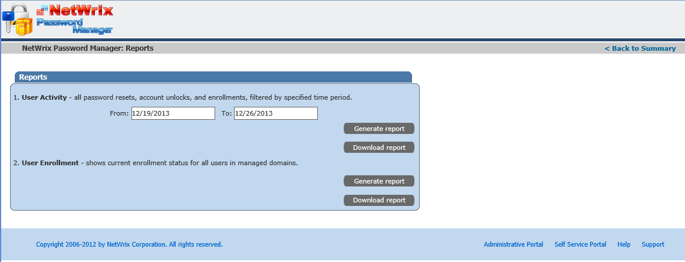

# Reports available within Password manager

Password Manager has two reports that might be useful for monitoring: the **User Activity report**, which shows all activities of a user within the application — enrollment, successful and failed password reset and change attempts, unlock operations — between two specified dates; and the **User Enrollment report**, which queries all users of all managed domains and shows if they are enrolled or not. The enrollment report also shows the OU that a user belongs to and the e-mail address specified during enrollment (the e-mail address is only requested if the Additional authentication feature is enabled). Reports can be generated online, or downloaded in `.csv` format.

To get to the Reports page:

1. Log in to the Helpdesk portal.
2. Click the **Reports** button under **Summary**.

