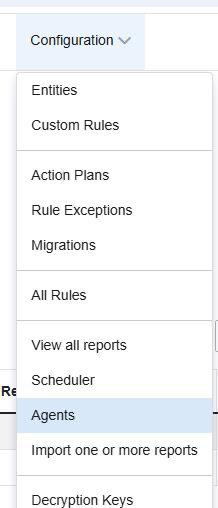
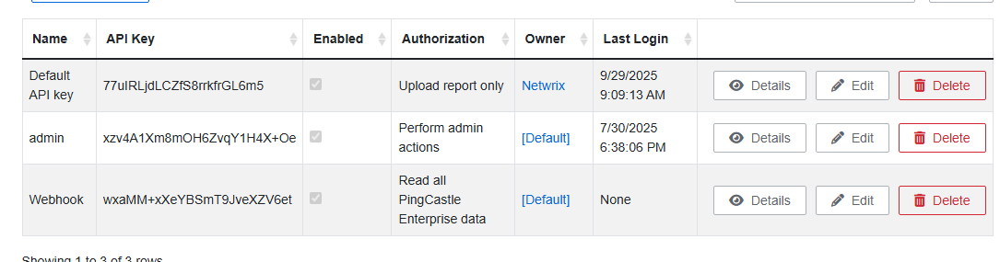
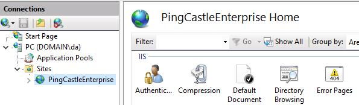
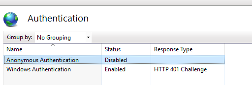
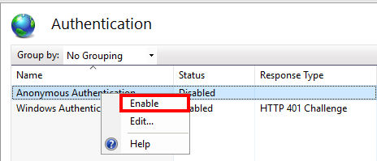

# Scheduler or Agent Deployment Returns 401 Unauthorized Error

## Related Queries

- "Receiving 401 unauthorized error when I launch the scheduler."
- "I have followed the steps to install with the appropriate rights and still get a 401 unauthorized error when trying to use the scheduler."
- "PingCastle agent unable to connect to API."
- "PingCastle swagger endpoint does not work."

## Symptom

> **NOTE:** If you are using the scheduler functionality from the PingCastle web application and your app pool manages the tasks, this article does not apply to your setup.

When attempting to use the scheduler for automation in PingCastle Pro or PingCastle Enterprise, or when sending data via command line or Swagger, you receive a 401 Unauthorized error. This issue has been persistent since the initial setup and has never worked automatically, requiring manual intervention.

Example log entries:

```
Starting the task: Retrieve Settings via API
[17:22:37] API Login OK
Exception: The remote server returned an error: (401) Unauthorized.
Task Retrieve Settings via API completed

Starting the task: Send via API
[17:24:24] API Login OK
domain.local
Exception: The remote server returned an error: (401) Unauthorized.
Task Send via API completed
```

## Cause

This issue occurs due to one or more of the following:

- An incorrect or mismatched API key in the scheduler, command line, or Swagger configuration
- **Anonymous Authentication** not enabled in IIS on the server hosting the PingCastle web application
- In some cases, insufficient permissions for the service account

## Resolution

1. In the PingCastle web application, navigate to **Configuration → Agents** to view the available API keys.

   

2. Locate the API key being used and compare it to the key configured in your command line, Swagger endpoint, or scheduler settings. Correct any mismatch.

   

3. Open **Task Scheduler** on the server, navigate to **Task Scheduler Library → PingCastle**, and verify that the API key configured in each scheduled task is correct.

4. Open **IIS Manager** on the server hosting the PingCastle Pro or PingCastle Enterprise web application.

5. In the left pane, expand **Sites** and select **PingCastlePro** or **PingCastleEnterprise**.

   

6. Double-click **Authentication** in the center pane.

   

7. Right-click **Anonymous Authentication** and select **Enable**.

   

8. Test the scheduler or agent again to confirm that the 401 Unauthorized error is resolved.

> **NOTE:** Changes to authentication settings in IIS take effect immediately; you do not need to restart IIS. Ensure that the scheduler configuration matches the settings in PingCastle Pro or PingCastle Enterprise. For more information, refer to [API Setup](https://docs.netwrix.com/docs/pingcastle/3_5/proinstall#api-key-and-endpoint).

## Related Links

- [API Setup](https://docs.netwrix.com/docs/pingcastle/3_5/proinstall#api-key-and-endpoint)
