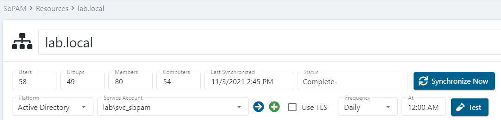

# Active Directory (AD) Users, Groups, or Computers Not Available to Add to SbPAM

## Summary

Recently created Active Directory (AD) users, groups, or computers may not be immediately available to be added to the Netwrix Privilege Secure console, due to the last time Active Directory was synced with Netwrix Privilege Secure.

## About domain synchronization

Domain synchronization is the process by which Netwrix Privilege Secure reads Active Directory to discover and import users, groups, and computers. When you add a domain as a resource in Privilege Secure, the product connects to that domain's AD and pulls in the current set of objects. Privilege Secure doesn't monitor AD for changes in real time — it relies on periodic synchronization to stay up to date.

This means that any AD objects created or modified after the last sync won't appear in the Privilege Secure console until the next synchronization runs. If you recently created a user, group, or computer in AD and can't find it in Privilege Secure, a stale sync is the most likely cause. Running a manual sync resolves the issue immediately.

## Instructions

1. Log in to Netwrix Privilege Secure as an admin user, and navigate to **Resources**.
2. Confirm the domain the desired users and/or groups are members of has already been added (synced) to Netwrix Privilege Secure.  
   - If the domain doesn't appear in the Resources table, add it using the **+ New Domain** button above the Resources table.
3. After confirming the domain is a resource in Netwrix Privilege Secure, click the domain's name in the Resources table.
4. Confirm the **Last Synchronized** date and time.  
   - If it is not recent, click **Synchronize Now** to immediately run a domain sync.

Upon successful domain sync, the **Last Synchronized** field for the domain will update. All users, groups, and computers in the domain will now be available to be onboarded to Netwrix Privilege Secure.
