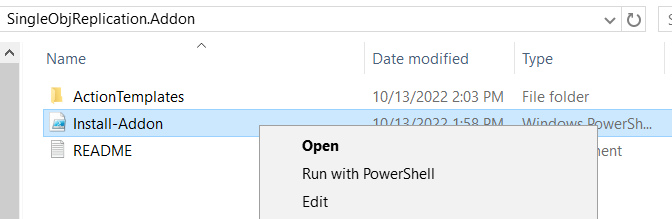
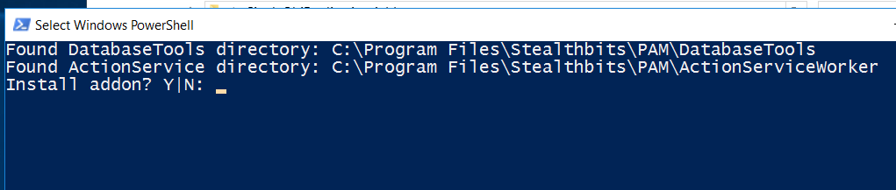

# How to Import a Custom Action Step for Single-object Replication

## Summary

It can be necessary in certain Active Directory environments to force replication when provisioning sessions. Netwrix Privilege Secure offers an out-of-the-box "Run Replication" step, but in certain Active Directory environments — often those geographically dispersed across multiple sites — this full replication step can be time consuming. In these instances, you can use a single-object replication step, which runs more quickly.

* **Note:** these instructions apply only to releases of Netwrix Privilege Secure prior to 3.7CU1 (3.7.1250). In Netwrix Privilege Secure 3.7.1250 and all subsequent releases, the **Run AD Replication for User** step is included by default.

## Instructions

1. First, download the `SingleObjReplication.Addon.zip` zip archive to the Netwrix Privilege Secure server:  
   https://www.netwrix.com/download/SingleObjReplication.Addon.zip

2. Extract the archive, which contains a README file, an ActionTemplates directory, and an `Install-Addon.ps1` script file. Right-click `Install-Addon.ps1` and select **Run with PowerShell**.  
   

3. When prompted, select "Y" to proceed.  
   

4. The PowerShell window should quickly execute the script and close.

5. Log in to the Netwrix Privilege Secure console. (If Netwrix Privilege Secure was already open, be sure to refresh the console.)

6. In Netwrix Privilege Secure, navigate to **Activities**, select an Activity, and click the green plus sign in either the **Pre-Session** or **Post-Session**. Note that the **Run AD Replication for User** activity step is now available.  
   
